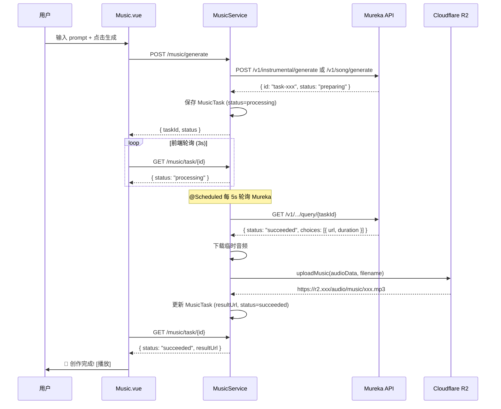
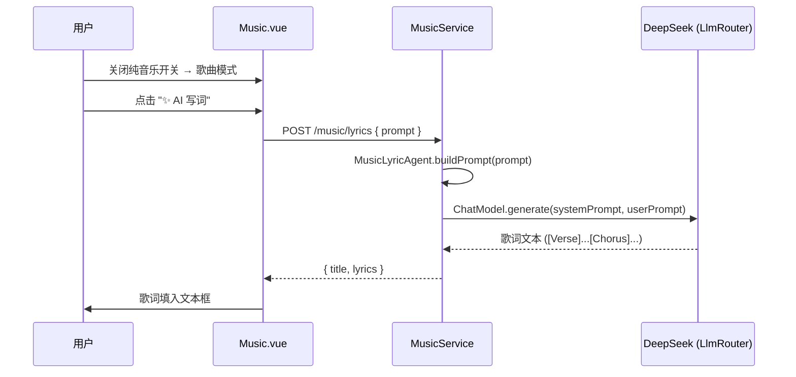

# AI 音乐模块技术文档

> 最后更新：2026-03-02

## 1. 模块概述

AI 音乐模块为用户提供 **AI 歌曲** 和 **纯音乐** 两种创作能力，集成 Mureka API 进行音频生成，集成 DeepSeek（via LlmRouter）进行 AI 歌词创作，生成结果持久化存储到 Cloudflare R2。

### 核心特性

| 特性 | 说明 |
|------|------|
| 纯音乐生成 | 根据风格描述 prompt 生成纯音乐 |
| 歌曲生成 | prompt + 歌词 → 带人声的完整歌曲 |
| AI 歌词生成 | 通过 DeepSeek 大模型生成专业格式歌词（支持中/英文） |
| R2 持久化 | 生成的音频自动下载并上传到 R2，替换 Mureka 临时 URL |
| 前端轮询 | 提交后自动轮询任务状态，完成后即时通知 |

---

## 2. 系统架构

```
┌──────────────┐         ┌──────────────┐         ┌──────────────┐
│   Music.vue  │───API──▶│ MusicController│───────▶│ MusicService │
│  (Frontend)  │         │   /music/*    │         │              │
└──────────────┘         └──────────────┘         └──────┬───────┘
                                                         │
                         ┌───────────────────────────────┼───────────────────┐
                         │                               │                   │
                         ▼                               ▼                   ▼
                 ┌──────────────┐              ┌──────────────┐    ┌──────────────┐
                 │ MurekaClient │              │  LlmRouter   │    │R2StorageAdapter│
                 │(歌曲/纯音乐) │              │ (AI 歌词)    │    │ (音频持久化)  │
                 └──────┬───────┘              └──────┬───────┘    └──────┬───────┘
                        │                             │                   │
                        ▼                             ▼                   ▼
                  Mureka API                    DeepSeek API        Cloudflare R2
                api.mureka.cn                                    audio/music/xxx.mp3
```

---

## 3. 后端核心文件

### 3.1 数据实体

**`MusicTask.java`** — `com.soundread.model.entity`

| 字段 | 类型 | 说明 |
|------|------|------|
| `id` | Long (雪花ID) | 主键，`@JsonSerialize(ToStringSerializer)` 防止 JS 精度丢失 |
| `userId` | Long | 创建用户 ID |
| `taskType` | String | `song` / `instrumental` / `lyrics` |
| `murekaTaskId` | String | Mureka 平台的任务 ID |
| `title` | String | 作品标题（取 prompt 前 20 字符） |
| `prompt` | String | 风格描述提示词 |
| `lyrics` | String | 歌词（song 类型） |
| `model` | String | 使用的模型（默认 `mureka-7.6`） |
| `status` | String | `pending` → `processing` → `succeeded` / `failed` |
| `resultUrl` | String | 生成的音频 URL（R2 永久链接） |
| `duration` | Integer | 时长（毫秒） |
| `errorMsg` | String | 错误信息 |
| `createdAt` | LocalDateTime | 创建时间（手动设置） |
| `finishedAt` | LocalDateTime | 完成时间 |
| `deleted` | Integer | 逻辑删除标记 |

> **重要**：`id` 和 `userId` 使用 `@JsonSerialize(using = ToStringSerializer.class)` 注解，
> 将 Long 序列化为 String，避免 JavaScript `Number.MAX_SAFE_INTEGER` (2^53) 精度丢失问题。

### 3.2 服务层

**`MusicService.java`** — `com.soundread.service`

核心方法：

| 方法 | 说明 |
|------|------|
| `submitGenerate(type, prompt, lyrics, model)` | 提交生成任务到 Mureka，保存 MusicTask 到数据库 |
| `generateLyrics(prompt)` | 调用 LlmRouter + MusicLyricAgent 生成 AI 歌词 |
| `pollMurekaTasks()` | `@Scheduled(fixedDelay=5000)` 定时轮询 Mureka 任务状态 |
| `persistToR2(taskId, tempUrl)` | 下载 Mureka 临时音频，上传到 R2 `audio/music/` 目录 |
| `listByUser()` | 获取当前用户任务列表 |
| `getTask(id)` | 查询单个任务 |
| `deleteTask(id)` | 逻辑删除任务 |

### 3.3 控制器

**`MusicController.java`** — `com.soundread.controller`

| 接口 | 方法 | 说明 |
|------|------|------|
| `POST /music/generate` | `startGenerate` | 提交音乐生成任务 |
| `POST /music/lyrics` | `generateLyrics` | AI 生成歌词 |
| `GET /music/task/{id}` | `getTask` | 查询任务状态 |
| `GET /music/list` | `listTasks` | 用户任务列表 |
| `DELETE /music/task/{id}` | `deleteTask` | 删除任务 |

> **注意**：`generate` 接口返回的 `taskId` 使用 `String.valueOf()` 转换，确保前端 ID 无精度损失。

### 3.4 AI 歌词生成

**`MusicLyricAgent.java`** — `com.soundread.agent.creative`

- 系统 Prompt 参考 Mureka 歌词格式：`[Intro]`、`[Verse]`、`[Chorus]`、`[Outro]`
- 自动检测中文关键词（`Chinese`、中文字符），生成中文歌词
- 通过 `LlmRouter.getChatModel()` 调用 DeepSeek 大模型

### 3.5 R2 存储

**`R2StorageAdapter.java`** — `com.soundread.adapter`

| 方法 | 存储路径 | 说明 |
|------|----------|------|
| `uploadAudio()` | `audio/tts1/` 或 `audio/tts2/` | TTS 语音合成音频 |
| `uploadMusic()` | `audio/music/` | **AI 音乐专用**，与 TTS 隔离 |
| `uploadVoiceSample()` | `voice-samples/` | 声音克隆样本 |

R2 存储目录结构：
```
audio/
  ├── tts1/       ← 基础 TTS 合成
  ├── tts2/       ← TTS v2 合成
  └── music/      ← AI 音乐（歌曲 + 纯音乐）
```

---

## 4. 前端核心文件

### 4.1 页面组件

**`Music.vue`** — `frontend/src/views/`

UI 布局（参考 Mureka 设计）：

```
┌────────────────────────────┐
│  ← AI 音乐                │  Header + 返回按钮
├────────────────────────────┤
│  描述你的音乐              │
│  ┌──────────────────────┐  │
│  │ r&b, slow, Chinese   │  │  共享 prompt 文本框
│  └──────────────────────┘  │
│  字数统计      纯音乐 [●]  │  Toggle Switch
│  创作灵感                  │
│  [✓ pop] [+ r&b] [+ rock] │  可切换标签
├────────────────────────────┤
│  歌词 (song 模式展开)      │  v-if="mode === 'song'"
│  ┌──────────────────────┐  │
│  │ [Verse]...           │  │
│  └──────────────────────┘  │
├────────────────────────────┤
│  🎼 生成纯音乐 / 🎤 生成歌曲│  提交按钮
│  ── AI 正在创作... ──────  │  紧凑进度条
├────────────────────────────┤
│  ⊙ 我的作品 (2 首)  全部 > │  默认显示 1 首
│  ┌──────────────────────┐  │
│  │ 🎵 r&b  3:24  3/2    │  │
│  └──────────────────────┘  │
└────────────────────────────┘
```

关键特性：
- **纯音乐/歌曲切换**：Toggle Switch 开关，非按钮切换
- **标签系统**：点击切换（已有则移除 / 没有则追加），与 prompt 文本实时联动
- **并发控制**：任务 processing 中禁用模式切换和生成按钮
- **紧凑进度条**：紧贴生成按钮下方，扫描动画（非大卡片）
- **作品列表**：默认显示最新 1 首，"查看全部" 展开

### 4.2 API 模块

**`music.js`** — `frontend/src/api/`

| 方法 | 接口 | 说明 |
|------|------|------|
| `generate(data)` | `POST /music/generate` | 提交生成任务 |
| `generateLyrics(prompt)` | `POST /music/lyrics` | AI 生成歌词 |
| `getTask(taskId)` | `GET /music/task/{id}` | 查询任务状态 |
| `listTasks()` | `GET /music/list` | 用户任务列表 |
| `deleteTask(taskId)` | `DELETE /music/task/{id}` | 删除任务 |

---

## 5. 数据流

### 5.1 音乐生成流程



### 5.2 歌词生成流程



---

## 6. 关键设计决策

### 6.1 雪花 ID 精度问题

**问题**：MyBatis-Plus `ASSIGN_ID` 生成 19 位 Long 型 ID，超过 JavaScript `Number.MAX_SAFE_INTEGER` (2^53 ≈ 16 位)，导致前端 ID 精度丢失，轮询查不到任务。

**解决方案**：
- `MusicTask` 实体 `id` / `userId` 字段加 `@JsonSerialize(using = ToStringSerializer.class)`
- `MusicController.generate()` 返回 `taskId` 用 `String.valueOf()` 转换

### 6.2 音频持久化策略

**问题**：Mureka 返回的音频 URL 为临时链接（24h 过期）。

**解决方案**：
- 后端定时轮询任务完成后，自动下载音频并上传到 R2
- 存储路径：`audio/music/music_{taskId}_{timestamp}.mp3`
- 失败时 fallback 使用原始临时 URL

### 6.3 前端并发控制

- 任务 processing 中时，Toggle Switch、生成按钮均禁用
- `isProcessing = computed(() => currentTask.status === 'processing' || generating)`
- 页面刷新后自动恢复轮询（`onMounted` 检查 processing 任务）

### 6.4 歌词多语言支持

- `MusicLyricAgent` 自动检测 prompt 中的 `Chinese` 关键词或中文字符
- 检测到中文时生成中文歌词，否则生成英文歌词
- 输出格式统一使用 `[Intro]`、`[Verse]`、`[Chorus]`、`[Outro]` 标记

---

## 7. 配置项

```yaml
# application.yml 中涉及的配置
mureka:
  api-key: ${MUREKA_API_KEY}
  base-url: https://api.mureka.cn

r2:
  bucket-name: aiyou
  public-domain: https://r2.joyoai.xyz
```

---

## 8. 数据库表

```sql
CREATE TABLE music_task (
    id              BIGINT PRIMARY KEY,
    user_id         BIGINT NOT NULL,
    task_type       VARCHAR(20) NOT NULL COMMENT 'song/instrumental/lyrics',
    mureka_task_id  VARCHAR(64),
    title           VARCHAR(100),
    prompt          TEXT,
    lyrics          TEXT,
    model           VARCHAR(50),
    status          VARCHAR(20) NOT NULL DEFAULT 'pending',
    result_url      VARCHAR(500),
    duration        INT,
    error_msg       TEXT,
    created_at      DATETIME,
    finished_at     DATETIME,
    deleted         TINYINT DEFAULT 0,
    INDEX idx_user_id (user_id),
    INDEX idx_status (status)
) ENGINE=InnoDB DEFAULT CHARSET=utf8mb4;
```

---

## 9. 首页入口

- 首页 **AI 工具箱** 中设有 **AI 音乐** 卡片（位于原"声音分身"位置）
- 标签显示"开始创作"，点击跳转 `/music` 路由
