# 声读 SoundRead — 项目全景概览

> **版本**: v3.3 (2026-03-07) · **架构**: Spring Boot 3.2 + Vue 3 + LangChain4j + 火山 TTS  
> **定位**: AI 驱动的 TTS 内容创作平台 — 语音合成 · 情感控制 · AI 播客 · AI 短剧 · 有声小说 · AI 创作工作台 · Agent 工具调用 · 声音克隆

---

## 一、系统架构

```mermaid
graph LR
    subgraph Frontend["🖥️ 前端 (Vue 3 · 16 Pages)"]
        FP1[Emotion V2<br>情感调音台]
        FP2[Create<br>快速合成]
        FP3[Discover<br>发现社区]
        FP4[Novel<br>有声小说]
        FP5[MyCreations<br>创作中心]
        FP6[AdminPolicy<br>运营后台]
        FP7[Studio<br>AI创作工作台]
    end
    subgraph Backend["⚙️ 后端 (Spring Boot · 15 Controllers · 18 Services)"]
        BC1[REST API Layer]
        BC2[AI Agent Layer<br>creative/ 8 · emotion/ 4 · drama/ 2]
        BC3[Service Layer]
        BC4[Adapter Layer]
    end
    subgraph Infra["🔌 基础设施"]
        I1[MySQL 8.x]
        I2[Redis 7.x]
        I3[Cloudflare R2]
        I4[火山 TTS/LLM]
    end
    Frontend --> Backend --> Infra
```

---

## 二、模块完成度矩阵

### 后端 (16 Controllers · 19 Services · 15 Agents)

| 模块 | Controller | Service | Agent | 状态 |
|:-----|:-----------|:--------|:------|:----:|
| **短文本 TTS (V1)** | `TtsController` | `Tts1Client` | — | ✅ 已上线 |
| **情感流式 TTS (V2)** | `TtsV2Controller` | `TtsV2Service` | — | ✅ 已上线 |
| **AI 剧本生成** | `TtsV2Controller` | `AiScriptService` | `agent/emotion/QuickDubbingAgent` `agent/emotion/DirectorScriptAgent` `agent/emotion/MoodAnalyzerAgent` `agent/drama/ScriptWriterAgent` | ✅ 已上线 |
| **动态指令库** | `AiPromptLibraryController` | `AiPromptLibraryService` | — | ✅ 已上线 |
| **用户认证** | `AuthController` | `AuthService` | — | ✅ 已上线 |
| **VIP 会员体系** | `VipController` | `VipService` | — | ✅ 已上线 |
| **SaaS 配额系统** | `TierPolicyController` | `TierPolicyService` + `QuotaService` | — | ✅ 已上线 |
| **音色库管理** | `VoiceController` | `VoiceService` | — | ✅ 已上线 |
| **内容发现社区** | `DiscoverController` | `ContentService` | — | ✅ 已上线 |
| **创作中心** | `CreationController` | `CreationService` + `StorageQuotaService` | — | ✅ 已上线 |
| **Agent 声音工坊** | `AgentController` | `TtsV2Service` + `VoiceService` + `CreationService` | `SmartAssistant` (Tool Calling) + `SoundReadTools` (5 工具·真实Service) | ✅ 已上线 |
| **AI 有声小说** | `NovelController` | `NovelService` + `NovelPipelineService` | `agent/drama/ChapterSplitterAgent` `agent/emotion/EmotionAnnotatorAgent` | 🔧 后端就绪 |
| **多角色剧本 (AI短剧)** | `TtsDramaController` | `TtsDramaService` | — | ✅ 已上线 |
| **双人播客** | `PodcastController` | `PodcastService` | — | 🔧 框架就绪 |
| **声音克隆** | `VoiceCloneController` | `VoiceCloneService` | — | ⚠️ TODO |
| **边听边问** | *(WebSocket)* | `AiInteractionService` | — | 🔧 框架就绪 |
| **AI 创作工作台** | `StudioController` | `StudioService` | `agent/creative/` 下 8 个独立 Agent（策略模式） | ✅ 已上线 |

### 前端 (16 Vue Pages · 5 Components · 3 Pinia Stores)

| 页面 | 文件 | 状态 | 页面 | 文件 | 状态 |
|:-----|:-----|:----:|:-----|:-----|:----:|
| 情感调音台 | `Emotion.vue` | ✅ | 有声小说 | `Novel.vue` | 🔧 |
| 快速合成 | `Create.vue` | ✅ | 我的创作 | `MyCreations.vue` | 🔧 |
| 发现社区 | `Discover.vue` | ✅ | 运营审核 | `AdminWorks.vue` | 📋 |
| 运营后台 | `AdminPolicy.vue` | ✅ | 多角色剧本 | `Drama.vue` | 🔧 |
| VIP 会员 | `Vip.vue` | ✅ | 双人播客 | `Podcast.vue` | 🔧 |
| 登录注册 | `Login.vue` | ✅ | 声音克隆 | `Clone.vue` | 🔧 |
| 个人中心 | `Profile.vue` | ✅ | 首页 | `Home.vue` | ✅ |
| AI 创作入口 | `Studio.vue` | ✅ | AI 创作工作台 | `StudioWorkbench.vue` | ✅ |

### 数据库 (17 张表 · 3 个 DDL 文件)

| 类别 | 表名 | 用途 |
|:-----|:-----|:-----|
| **用户** | `user` `vip_order` | 用户体系 + VIP 订单 |
| **TTS** | `tts_task` `cloned_voice` | 异步任务 + 克隆声音 |
| **策略** | `sys_tier_policy` `sys_voice` `user_voice` | SaaS 配额 + 音色库 + 用户音色资产 |
| **AI 指令** | `ai_prompt_category` `ai_prompt_role` | 动态场景指令库 |
| **内容** | `work` `ai_interaction` | 发现页作品 + AI 对话 |
| **持久化** | `user_creation` `user_storage` | 创作记录 + 存储计量 |
| **有声书** | `novel_project` `novel_chapter` `novel_segment` | 项目 + 章节 + 分段 |
| **AI 创作** | `creative_template` `studio_project` `studio_section` | 创作类型 + 创作项目 + 内容分段 |

---

## 三、核心技术亮点 (23 条 ADR)

> 详见 `04_面试ADR手册.md`，以下为索引。

| # | 亮点 | 关键文件 |
|:--|:-----|:---------|
| 1 | LangChain4j 声明式 AI Agent（三模块分包：creative/emotion/drama） | `agent/creative/` `agent/emotion/` `agent/drama/` |
| 2 | SSE 流式打字机 + 弱网攻坚 | `TtsV2Controller` `Emotion.vue` |
| 3 | 三级瀑布降级模型路由 | `LlmRouter` |
| 4 | SaaS 动态配额 (DB + Redis) | `TierPolicyService` `QuotaService` |
| 5 | 防腐层指令编译器 (ACL) | `TtsV2Service` |
| 6 | 多维上下文 Pipeline 注入 | `Emotion.vue` `TtsV2Service` |
| 7 | 全栈 B 端动态指令库 | `ai_prompt_category` + `ai_prompt_role` |
| 8 | 端侧幂等防重与成本管控 | `Create.vue` (Hash比对) |
| 9 | 阶梯式鉴权拦截链 | `VoiceServiceImpl` |
| 10 | 全局播放器状态提升 | `playerStore` + `GlobalPlayer.vue` |
| **11** | **Multi-Agent Pipeline 编排** | `NovelPipelineService` |
| **12** | **结构化情感状态机** | `EmotionState` |
| **13** | **存储配额执行层** | `StorageQuotaService` + `user_storage` |
| **14** | **创作→发布→审核全链路** | `user_creation` → `work` |
| **23** | **策略模式 + 工厂模式：8 类创作 Agent** | `CreativeAgentFactory` `AbstractCreativeAgent` |
| **24** | **LangChain4j Tool Calling Agent** | `SmartAssistant` `SoundReadTools` `AgentController` |
| **25** | **AI短剧全链路（生成→配音→发布→锁定）** | `StudioWorkbench.vue` `TtsV2Service` |
| **26** | **TTS v2 指数退避重试 + 请求节流** | `TtsV2Service` |

---

## 四、待落地功能与演进路线

### 🟡 框架就绪（骨架存在，需联调完善）

| 功能 | 剩余工作 |
|:-----|:---------|
| **双人播客** | 打通 WebSocket 音频推流到前端播放器 |
| **多角色剧本** | 完善前端多角色预览与角色分配 |
| **边听边问** | 暴露 REST/WebSocket 端点 + 前端组件 |
| **有声小说 TTS 合成** | Pipeline Stage 4 对接 Tts2Client WebSocket + section_id 串联 |

### 🔴 需重点攻坚

| 功能 | 阻塞点 |
|:-----|:-------|
| **声音克隆** | `VoiceCloneService.startCloneTraining()` 需接入火山引擎克隆 API |

### 📋 规划中（按优先级）

| 阶段 | 内容 | 优先级 |
|:-----|:-----|:------:|
| **SRE** | SkyWalking 全链路追踪 · Prometheus APM · Sentinel 熔断 · RocketMQ DLQ | P1 |
| **商业化** | 分布式事务(支付回调) · 策略体系 V2(时间维配额) · 积分经济 | P1 |
| **内容生态** | HeatScoreJob · DataRetentionJob · Admin 审核 API · AdminWorks 完整实现 | P1 |
| **云原生** | Docker + K8s · Caffeine 多级缓存 · WebSocket 连接池 | P2 |
| **前端工程化** | Nuxt.js SSR · IndexedDB 音频缓存 · `v-policy` 指令级权限 | P3 |

---

## 五、量化统计

| 维度 | 数值 |
|:-----|:-----|
| 后端 Controller | 16 个 |
| 后端 Service | 19 个 (含 2 个 impl) |
| AI Agent | 15 个 (creative/ 8 + emotion/ 4 + drama/ 2 + toolcalling/ 1) |
| SDK 适配 | 24 个文件 (TTS v1/v2 + Podcast) |
| 前端页面 | 16 个 Vue SFC |
| 前端全局组件 | 5 个 |
| 数据库表 | 17 张 |
| 面试 ADR | 24 条 |
| 文档 | 7 份 |
