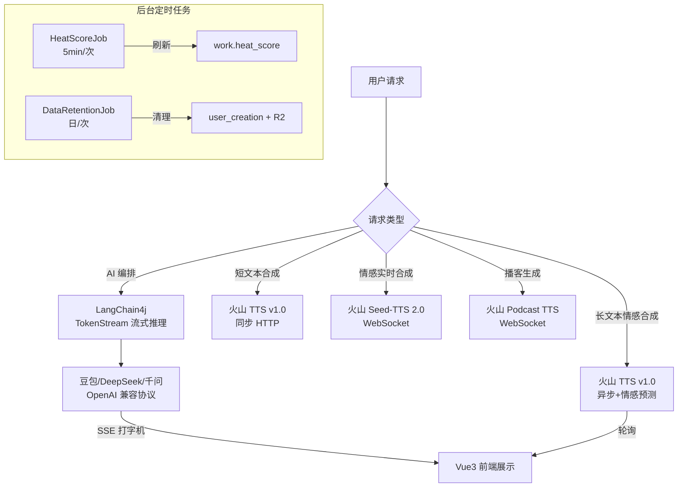

# 声读 SoundRead — 前后端技术选型文档

> **版本**: v3.2 (2026-03-04)
> **定位**: 记录项目完整的技术栈选型、版本号、以及每项技术的**选用理由**，便于团队对齐认知和面试讲述。

---

## 一、后端技术栈 (Spring Boot)

| 分类 | 技术 | 版本 | 选用理由 |
|:-----|:-----|:-----|:---------|
| **核心框架** | Spring Boot | 3.2.5 | Java 生态最主流的微服务脚手架，搭配 JDK 17 使用虚拟线程与 Record 等新特性 |
| **JDK** | OpenJDK | 17 LTS | 长期支持版本，支持 `text blocks`、`sealed class` 等现代语法 |
| **认证鉴权** | Sa-Token | 1.38 | 国产轻量级权限框架，支持 JWT 模式、Redis 会话共享、注解式鉴权 (`@SaCheckRole`) |
| **ORM** | MyBatis-Plus | 3.5.6 | 自带代码生成、分页插件、逻辑删除、JSON TypeHandler，减少 XML 编写 |
| **数据库** | MySQL | 8.x | 主力关系型数据库，承载核心用户体系、音色字典表、SaaS 等级配额表、以及**动态 AI 场景指令库配置表**等 |
| **缓存** | Redis | 7.x | 会话管理 (Sa-Token)、配额计数 (`INCRBY`)、策略缓存热更新 |
| **消息队列** | RocketMQ | 2.3.0 (starter) | 长文本异步合成、声音克隆等耗时任务的异步解耦与削峰 |
| **对象存储** | Cloudflare R2 | AWS SDK 2.25 | S3 兼容协议，零出口流量费，搭配自定义域名实现音频 CDN 分发 |
| **HTTP 客户端** | OkHttp | 4.12 | 火山引擎 TTS/LLM REST API 的底层通信层 |
| **JSON** | FastJSON2 | 2.0.47 | 高性能序列化，用于火山引擎 SDK 的请求/响应体构建 |
| **工具库** | Lombok / Commons-Lang3 | — | 减少样板代码、字符串处理工具 |

### 持久化与内容生态层 (NEW 🔥)

| 分类 | 技术 | 说明 |
|:-----|:-----|:-----|
| **统一创作记录** | `user_creation` 表 + `CreationService` | 覆盖 tts/emotion/drama/podcast/novel 五类创作 |
| **存储配额执行** | `user_storage` 表 + `StorageQuotaService` | 原子性 UPSERT 计量，上传前拦截，支持运营手动覆盖 |
| **有声小说 Pipeline** | `NovelPipelineService` (4阶段异步) | AI 分章 → 自然断句分段 → AI 情感标注 → TTS 2.0 逐段合成 |
| **情感状态机** | `EmotionState` | 结构化跨段落传递 mood/tension/summary |
| **内容发布流** | `user_creation` → `work` 表 | 创作→发布→审核→热度排序，VIP 免审核 |

### 运营管控与定时任务 (NEW 🔥)

| 分类 | 技术 | 说明 |
|:-----|:-----|:-----|
| **admin 审核 API** | `AdminWorkController` + `AdminWorkService` | 作品列表(多维筛选) / 审核(approve/reject) / 精选切换 / 统计看板 |
| **热度定时刷新** | `HeatScoreJob` (`@Scheduled`) | 每5分钟批量刷新已通过作品的 `heat_score`，公式：播放×1+点赞×3+分享×5+评论×2+精选+50 |
| **数据保留清理** | `DataRetentionJob` (`@Scheduled`) | 每天凌晨3点按用户等级清理过期创作记录，回收 R2 存储 + `user_storage` 空间 |
| **R2 对象删除** | `R2StorageAdapter.deleteByUrl()` | 从公开 URL 反解 key 调用 S3 DeleteObject，配合保留策略清理 |
| **定时任务选型** | Spring `@Scheduled` (非 XXL-JOB) | 当前单机部署够用，后续多实例再迁移 XXL-JOB 防重复执行 |

### AI 创作工作台 (NEW 🔥)

| 分类 | 技术 | 说明 |
|:-----|:-----|:-----|
| **多形态创作引擎** | `StudioService` + `LlmRouter` | 8大创作类型（小说/广播剧/播客/电台/讲解/带货/绘本/新闻），AI 角色 Prompt 运营可配 |
| **动态角色注入** | `creative_template.ai_role` | 每种创作类型的 AI System Prompt 存在数据库，新增类型只需 INSERT 一行 |
| **上下文续写 (RAG)** | Context Injection | 将大纲+角色设定+最近3段已完成内容注入 System Prompt，解决大模型续写"失忆"问题 |
| **灵感种子 Agent** | 同步 `ChatModel` | 一次性生成 6 个创意灵感，返回 JSON 数组 |
| **大纲生成 Agent** | 同步 `ChatModel` | 根据灵感生成结构化大纲（标题+梗概+章节+角色），返回 JSON |
| **流式创作 Agent** | 流式 `StreamingModel` (SSE) | 角色驱动的流式内容生成+段落改写/扩写/缩写 |

### AI 大模型技术栈 (重点亮点 🔥)

| 分类 | 技术 | 版本 | 选用理由 |
|:-----|:-----|:-----|:---------|
| **LLM 编排架构** | LangChain4j + 自建 `LlmRouter` | 0.30.0 | **企业级 AI 中枢：** 1. **声明式极简开发**：基于 `@AiService` 将 AI 交互抽象为 Java 接口，彻底告别 OkHttp 手工拼 JSON。 2. **场景上下文管理 (Context Injection)**：利用 `@SystemMessage` 配合模板变量 `{{theme}}`，将会话记忆和业务限定词强行注入，**有效抑制大模型发散幻觉 (Hallucination)**。 3. **动态路由降级**：自建 `LlmRouter` 读取数据库策略，实现不同等级用户动态切换模型（如普通用户用豆包，VIP用深海），**免发版热更新**。 |
| **流式交互引擎** | SSE + TokenStream | 原生 | **毫秒级首字响应 (TTFT) 架构：** 彻底摒弃会造成阻塞的同步等待。后端通过 LangChain4j 的 `TokenStream` 接管模型异步回调，将生成的 Token 实时转化为 Server-Sent Events 流推向前端大盘；前端再通过递归解析 `ReadableStream` 配合动态光标渲染，实现了极致流畅的打字机交互效果。同时依靠前后端双闭环，彻底攻克了传统 SSE 在弱网下容易“断层吞字”的顽疾。 |
| **大语言底座** | 火山豆包 / Kimi-K2.5 / DeepSeek / MiniMax | Seed 2.0 / K2.5 / V3 | 默认挂载豆包系模型用于日常推断，Tool Calling 场景优先使用 Kimi-K2.5（速度快、Function Calling 支持好）。得益于自研 AI 网关层的极度解耦，系统完全兼容 OpenAI API 规范，随时可切换。 |
| **TTS 引擎 v1.0 (底层)** | 火山引擎语音合成 | 同步 HTTP API | 短文本与长文本异步合成的基石，内置初步的情感预测引擎 (`useEmotion=true`)。 |
| **TTS 引擎 v2.0 (旗舰)** | 火山引擎 Seed-TTS 2.0 | WebSocket 双向协议 | **情感流式调公台专属通信协议**。本项目实现了全链路语境注入：**前端采用 Pipeline 流水线 UI 同时补齐剧情上文与指令，后端 `TtsV2Service` 将其编译为非破坏性的 `context_texts` 原生数组（Index 0:剧情, Index 1:指令），确保 AI 对合成情绪的极致感知。** |
| **播客引擎** | 火山引擎 Podcast TTS | WebSocket | 双人对话播客生成 |
| **AI 分章 Agent** | `ChapterSplitterAgent` (LangChain4j) | 0.30.0 | 有声小说智能分章，输出 JSON 数组 |
| **AI 情感标注 Agent** | `EmotionAnnotatorAgent` (LangChain4j) | 0.30.0 | 逐段注入 cot 标签 + context_texts + tension_level |

### Agent Tool Calling 智能体 (NEW 🔥)

| 分类 | 技术 | 说明 |
|:-----|:-----|:-----|
| **声明式 Agent 接口** | `SmartAssistant` (LangChain4j `AiServices`) | 无需实现类，框架动态代理生成；`@SystemMessage` 定义角色，`@UserMessage` 接收用户输入 |
| **工具集注册** | `SoundReadTools` (5 个 `@Tool` 方法) | 查音色 / 生成台本 / 情感分析 / TTS 合成 / 查作品，LLM 自主决策调用 |
| **底层协议** | OpenAI Function Calling | LLM 返回 `tool_calls` JSON → 框架反射调用 Java 方法 → 结果回传 LLM |
| **模型降级链** | Kimi-K2.5 → MiniMax → DeepSeek | 按优先级选择支持 Function Calling 的通用模型（非推理模型） |
| **会话记忆** | `MessageWindowChatMemory` (10轮窗口) | 多轮工具调用保持上下文连贯 |

---

## 二、前端技术栈 (Vue 3)

| 分类 | 技术 | 版本 | 选用理由 |
|:-----|:-----|:-----|:---------|
| **核心框架** | Vue 3 | 3.x | Composition API + `<script setup>` 的开发范式，组合逻辑高度解耦 |
| **构建工具** | Vite | 5.x | 毫秒级 HMR 热更新，ES Module 原生支持 |
| **路由** | Vue Router | 4.x | 嵌套路由 + 路由守卫实现鉴权 (`requiresAdmin` / `requiresAuth`) |
| **状态管理** | Pinia | 2.x | 替代 Vuex，支持 LocalStorage 持久化；承载用户 `policy` 配置树与全局播放器状态 |
| **HTTP 客户端** | Axios | 1.x | RESTful 请求封装，统一拦截器处理 401/403 |
| **流式通信** | Fetch API (SSE) | 原生 | AI 剧本打字机效果，`ReadableStream` 逐块读取 |
| **UI 样式** | TailwindCSS | 3.x | 原子化 CSS，快速构建响应式深色主题 UI |
| **图标** | Font Awesome | 6.x | 全站图标统一风格 |

---

## 三、基础设施与 DevOps

| 分类 | 技术 | 说明 |
|:-----|:-----|:-----|
| **版本控制** | Git | 主干开发模式 |
| **构建** | Maven 3.9+ / npm | 后端 Maven、前端 npm |
| **CDN / 存储** | Cloudflare R2 + 自定义域名 | 音频资源全球边缘加速 |
| **部署** | JDK 17 + Vite Preview | 当前为单机部署，预留 Docker 化改造 |

---

## 四、技术选型决策摘要

> **核心设计哲学**: 在 AI 调用层统一使用 LangChain4j 抹平多模型差异；在通信协议层按业务特征分治 (SSE 单向推送 vs WebSocket 双向流)；在鉴权层通过 JSON 策略字典实现零发版热更。
