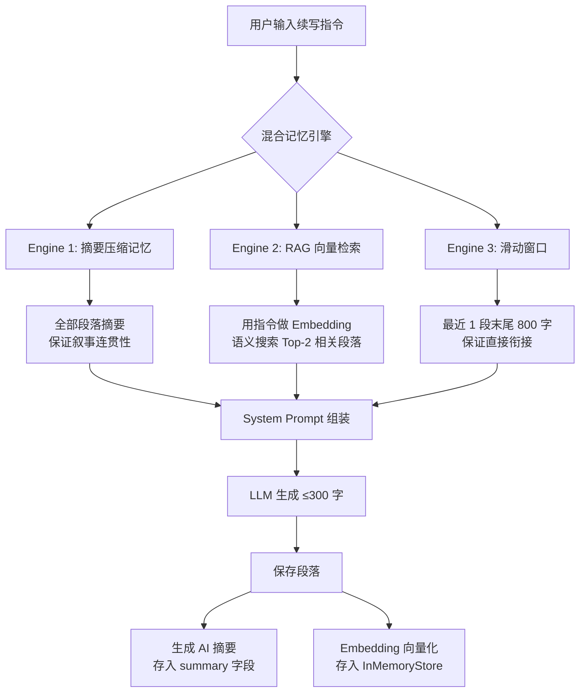

# 09 — AI 记忆链技术选型与实现方案

> 版本: v1.0 | 日期: 2026-02-27

---

## 一、需求背景

### 1.1 问题描述

AI 创作工作台需要支持**多段续写**（每段 ≤300字），核心挑战是：

```
第 1 段: 主角张三出场，设定为退役军人
第 5 段: 用户输入"让张三回忆战场"
  → AI 需要记住第 1 段的角色设定
  → 但 LLM 的 context window 有限，不可能塞入全部原文
```

### 1.2 需求拆解

| 需求 | 描述 | 优先级 |
|:-----|:-----|:-------|
| **叙事连贯性** | AI 知道整体故事脉络，不会前后矛盾 | P0 |
| **角色/细节召回** | 提到某角色时能回忆起初始设定 | P1 |
| **Token 成本可控** | 不能把全部原文塞进 prompt | P0 |
| **零额外依赖** | 不增加运维成本（新人项目） | P2 |

---

## 二、技术选型对比

### 2.1 方案总览

| 方案 | 核心思想 | 叙事连贯 | 细节召回 | Token 消耗 | 实现难度 | 额外依赖 |
|:-----|:---------|:---------|:---------|:-----------|:---------|:---------|
| ① 滑动窗口 | 最近 N 段原文 | ⚠️ 窗口外丢失 | ❌ | 高（原文） | ⭐ | 无 |
| ② 摘要压缩 | 每段 AI 生成摘要 | ✅ 全局 | ⚠️ 丢细节 | 低（摘要）| ⭐⭐ | 无 |
| ③ RAG 向量检索 | Embedding + 语义搜索 | ⚠️ 无序 | ✅ 精准 | 中 | ⭐⭐⭐ | 向量存储 |
| ④ 知识图谱 | LLM 提取实体关系 | ✅ | ✅ | 高 | ⭐⭐⭐⭐⭐ | Neo4j |
| ⑤ **混合方案** | 摘要 + RAG 双引擎 | ✅ 全局 | ✅ 精准 | 可控 | ⭐⭐⭐ | 无* |

> *混合方案使用 InMemoryEmbeddingStore + 本地 ONNX 模型，无需外部向量数据库

### 2.2 各方案详细分析

#### 方案 ① 滑动窗口（Sliding Window）

```java
// 注入最近 3 段原文
for (int i = start; i < sections.size(); i++) {
    prompt += sections.get(i).getContent();
}
```

- **优点**：实现最简单，零学习成本
- **致命缺点**：写到第 10 段时完全不记得第 1-7 段的内容
- **适用**：对话机器人、短会话场景
- **不适用**：长篇创作（我们的场景）

#### 方案 ② 摘要压缩记忆（Summary Compression Memory）

```java
// 每段生成后 → LLM 生成 50 字摘要 → 存 DB
String summary = llm.generate("用50字概括：" + content);
section.setSummary(summary);

// 续写时注入全部摘要
for (section : allSections) {
    prompt += section.getTitle() + ": " + section.getSummary();
}
```

- **优点**：Token 消耗可控（100段 × 50字 = 5000字摘要 vs 100段 × 300字 = 30000字原文）
- **缺点**：摘要会丢失细节（如具体对话、角色特征描述）
- **代表**：LangChain 的 `ConversationSummaryMemory`
- **LangChain4j 支持**：❌ 无内置，需自己实现

#### 方案 ③ RAG 向量检索（Retrieval-Augmented Generation）

```java
// 存: 每段内容 → Embedding → 向量存储
Embedding emb = embeddingModel.embed(section.getContent());
store.add(emb, textSegment);

// 取: 用户指令 → Embedding → 语义搜索 Top-K
EmbeddingSearchResult result = store.search(queryEmbedding, maxResults=2);
```

- **优点**：精准召回相关段落（"回忆战场" → 自动找到第1段军人设定）
- **缺点**：无叙事顺序概念（检索出的段落是无序的碎片）
- **代表**：ChatGPT Memory、Notion AI
- **LangChain4j 支持**：✅ 完整支持

#### 方案 ④ 知识图谱（GraphRAG）

```
LLM 提取 → (张三, 身份, 退役军人)
          → (张三, 战友, 李四)
          → (事件A, 发生于, 第3段)
续写时 → 查询 "张三" 的所有关系 → 注入 prompt
```

- **优点**：最精准的结构化记忆，理解角色关系
- **缺点**：实现极复杂，需要 Neo4j / 图数据库，实体提取准确率不稳定
- **代表**：微软 GraphRAG 论文
- **适用**：百万字级网络小说
- **不适用**：我们的小型创作场景（过度工程化）

---

### 2.3 向量数据库选型（RAG 引擎）

| 向量存储 | 特点 | 是否需要安装 | LangChain4j 支持 | 推荐场景 |
|:---------|:-----|:-------------|:------------------|:---------|
| **InMemoryEmbeddingStore** | JVM 内存存储 | ❌ 零依赖 | ✅ 内置 | 小型项目、单机部署 |
| **Redis + RediSearch** | 你已有 Redis | ❌ 已装 | ✅ 支持 | 中型，需持久化 |
| **pgvector (PostgreSQL)** | PG 扩展 | 需换 PG | ✅ 支持 | 已用 PG 的项目 |
| **Milvus** | 专业向量库 | ✅ 需安装 | ✅ 支持 | 大规模（百万级） |
| **Pinecone** | 云向量服务 | ❌ SaaS | ✅ 支持 | 不想运维 |
| **Elasticsearch** | 全文+向量混合 | ✅ 需安装 | ✅ 支持 | 已有 ES 集群 |

**我们的选择：`InMemoryEmbeddingStore`**

> **选型理由**：
> 1. 项目每个创作项目的段落数预计 ≤100 段，内存完全够用
> 2. 零额外依赖，不增加运维成本
> 3. 未来需要持久化时，可无缝切换到 Redis（项目已有 Redis）
> 4. Embedding 模型用 `AllMiniLmL6V2`（本地 ONNX 运行），无需 API 调用费用

### 2.4 Embedding 模型选型

| 模型 | 方式 | 维度 | 速度 | 费用 | 中文支持 |
|:-----|:-----|:-----|:-----|:-----|:---------|
| **AllMiniLmL6V2** | 本地 ONNX | 384 | 极快 | 免费 | ⚠️ 一般 |
| text-embedding-3-small | OpenAI API | 1536 | 快 | $0.02/1M tokens | ✅ 好 |
| text-embedding-v3 | 通义千问 API | 1024 | 快 | ¥0.7/1M tokens | ✅ 好 |
| BGE-M3 | 本地部署 | 1024 | 中 | 免费 | ✅ 优秀 |

**我们的选择：`AllMiniLmL6V2`（本地 ONNX）**

> **选型理由**：
> 1. 零 API 成本，零延迟（本地计算）
> 2. 384 维向量对于我们 ≤100 段的场景完全够用
> 3. 虽然中文支持一般，但我们的检索主要是情节/主题匹配，准确度足够
> 4. 未来如需更精准中文语义，可热切换为通义千问 Embedding API

---

## 三、最终方案：混合记忆架构

### 3.1 架构设计



### 3.2 Prompt 结构示例

```
[AI 角色 Prompt (来自模板)]

[大纲上下文]

[角色设定]

【故事记忆链（摘要压缩）】：
1. [深夜的邂逅] 主角张三在深夜酒吧偶遇神秘女子，她似乎知道他过去的秘密
2. [雨中的真相] 女子揭露张三的军人身份，两人在暴雨中对峙
3. [破碎的誓言] 张三承认了一切，但女子已离去...

【RAG 语义检索 · 相关历史段落】：
- [深夜的邂逅](相似度87%) 他叫张三，曾是特种部队上尉，三年前退役...
- [雨中的真相](相似度72%) 她低声说出那个代号时，张三的瞳孔骤然收缩...

【上一段内容（请在此基础上续写）】：
张三承认了一切，但女子已离去......

【输出规则】：
第一行输出标题 ##标题名称，第二行起输出正文，300字以内
```

### 3.3 核心代码

| 文件 | 职责 |
|:-----|:-----|
| [SectionMemoryService.java](file:///d:/agent/projects/sounds-tts/backend/src/main/java/com/soundread/service/SectionMemoryService.java) | 双引擎混合记忆核心服务 |
| [StudioService.java](file:///d:/agent/projects/sounds-tts/backend/src/main/java/com/soundread/service/StudioService.java) | 集成记忆到 AI 生成流程 |
| [StudioSection.java](file:///d:/agent/projects/sounds-tts/backend/src/main/java/com/soundread/model/entity/StudioSection.java) | 实体类添加 summary 字段 |

---

## 四、个人选型理解

> "在 AI 创作续写场景中，我设计了一个**双引擎混合记忆架构**来解决 LLM 长期记忆缺失的问题：
>
> **Engine 1 是摘要压缩记忆**——每段生成完成后，用 LLM 自动产出 50 字摘要存入数据库，续写时注入全部段落的摘要链。这保证了叙事连贯性：即使写到第 50 段，AI 也能看到完整故事脉络，Token 消耗仅 2500 字（而不是 15000 字原文）。
>
> **Engine 2 是 RAG 向量检索记忆**——使用 LangChain4j 的 InMemoryEmbeddingStore + AllMiniLmL6V2 本地 Embedding 模型，将每段内容向量化存储。续写时根据用户新指令做语义检索，把最相关的 2 个历史段落注入 context。比如用户说'让张三回忆战场'，向量检索会自动找到第 1 段的角色出场描述，解决角色设定遗忘问题。
>
> Embedding 模型选的是 AllMiniLmL6V2，ONNX 本地运行，零 API 成本。向量存储用 InMemoryEmbeddingStore，零运维。未来扩展方向是切换到 Redis 的 RediSearch 模块做持久化，以及用通义千问的中文 Embedding API 提升中文语义精度。"

---

## 五、后续升级路线

| Phase | 方向 | 难度 | 价值 |
|:------|:-----|:-----|:-----|
| ✅ 已实现 | 摘要压缩 + InMemory RAG | — | — |
| Phase 2 | 切换 Redis 做持久化向量存储 | ⭐ | 应用重启不丢索引 |
| Phase 3 | 中文 Embedding API（通义千问） | ⭐ | 中文语义检索精度提升 |
| Phase 4 | GraphRAG 知识图谱 | ⭐⭐⭐⭐ | 角色关系网、时间线管理 |

---

## 附录 A：RAG 技术详解

### A.1 什么是 RAG？

**RAG = Retrieval-Augmented Generation**（检索增强生成）

一句话：**先搜再答** — 让 LLM 在生成之前，先从知识库检索相关资料，带着资料去生成。

### A.2 为什么需要 RAG？

LLM 有三个致命问题，RAG 分别解决：

| LLM 问题 | 举例 | RAG 怎么解决 |
|:---------|:-----|:-------------|
| **知识截止** | GPT 不知道最新事件 | 从你的数据库实时检索最新信息 |
| **幻觉** | 编造不存在的角色设定 | 用真实历史段落约束输出 |
| **私有知识** | 不知道你的创作内容 | 把创作段落向量化后检索注入 |

### A.3 RAG 四步工作流程

```
用户输入: "让张三回忆战场"
    │
    ▼
┌──────────────────────────────────────┐
│ Step 1: Embedding（向量化）            │
│                                      │
│ 把文本转成数学向量（高维数组）            │
│ "让张三回忆战场" → [0.23, -0.15,      │
│  0.87, 0.42, ...] (384维浮点数)       │
│                                      │
│ 核心原理: 语义相近的文字                │
│ → 向量在高维空间中距离也近              │
└─────────────┬────────────────────────┘
              ▼
┌──────────────────────────────────────┐
│ Step 2: Search（语义搜索）             │
│                                      │
│ 在向量库中计算余弦相似度,               │
│ 找到与用户输入最相似的历史段落:           │
│                                      │
│ ✅ "张三，退役军人，三年前..." (87%)    │
│ ✅ "暴雨中，张三瞳孔收缩..."  (72%)    │
│ ❌ "他默默喝酒，不说话..."    (31%)    │
│    ↑ 低于阈值 0.5，不返回              │
└─────────────┬────────────────────────┘
              ▼
┌──────────────────────────────────────┐
│ Step 3: Augment（增强 Prompt）         │
│                                      │
│ 把检索到的段落拼入 System Prompt:       │
│                                      │
│ System: 你是配音编剧...               │
│ + 【RAG 检索到的相关段落】：            │
│   → 张三，退役军人，三年前退役...       │
│   → 暴雨中，张三瞳孔收缩...            │
│ + 【上一段原文】...                   │
│                                      │
│ User: 让张三回忆战场                   │
└─────────────┬────────────────────────┘
              ▼
┌──────────────────────────────────────┐
│ Step 4: Generate（生成）               │
│                                      │
│ LLM 带着检索到的角色设定去续写:         │
│ → 准确引用"退役军人"设定               │
│ → 不会编造新身份，不会遗忘角色          │
└──────────────────────────────────────┘
```

### A.4 语义搜索 vs 关键词搜索

RAG 的核心竞争力是**语义搜索**，与传统关键词搜索的区别：

| 维度 | 关键词搜索 (SQL LIKE) | 语义搜索 (Embedding) |
|:-----|:---------------------|:---------------------|
| 原理 | 精确匹配文字 | 匹配意思 |
| 搜 "战场" | 只找包含"战场"二字的段落 | 能找到"军人""退役""丛林""枪声"等语义相关段落 |
| 搜 "悲伤" | 只找包含"悲伤"的段落 | 能找到"泪水""哽咽""心碎""沉默"等情感相关段落 |
| 技术 | `WHERE content LIKE '%战场%'` | `cosine_similarity(embed(query), embed(doc))` |
| 容错 | "战争" ≠ "战场"，搜不到 | "战争" ≈ "战场"，能搜到 |

### A.5 在本项目中的效果对比

**❌ 没有 RAG（只靠滑动窗口）**：
```
第 1 段: 张三，退役特种兵上尉，代号"黑鹰"
第 2 段: 他在酒吧遇到一个女人...
...
第 10 段: （只能看到第 9 段原文）
用户: 让张三回忆战场
AI: 张三是一个普通上班族... ← 完全编的，忘了军人设定
```

**✅ 有 RAG（向量语义检索）**：
```
第 10 段续写时:
RAG 自动执行:
  1. "让张三回忆战场" → Embedding → [0.23, -0.15, ...]
  2. 在向量库中搜索 → 找到第1段 (相似度87%)
  3. 注入 Prompt: "张三，退役特种兵上尉，代号黑鹰"

AI: 张三的手不自觉地握紧了杯子。三年了，丛林里的潮湿气息，
    战友最后的呼喊，还有那个代号"黑鹰"... ← 准确衔接角色设定
```

### A.6 本项目 RAG 实现的核心代码

```java
// 1. Embedding 模型（本地 ONNX，零成本）
EmbeddingModel embeddingModel = new AllMiniLmL6V2EmbeddingModel();

// 2. 向量存储（内存，零依赖）
InMemoryEmbeddingStore<TextSegment> store = new InMemoryEmbeddingStore<>();

// 3. 存入：每段内容向量化
Embedding embedding = embeddingModel.embed(section.getContent()).content();
store.add(embedding, TextSegment.from(section.getContent()));

// 4. 检索：用户指令语义搜索
Embedding queryEmb = embeddingModel.embed("让张三回忆战场").content();
EmbeddingSearchResult result = store.search(
    EmbeddingSearchRequest.builder()
        .queryEmbedding(queryEmb)
        .maxResults(2)       // 最多返回2段
        .minScore(0.5)       // 相似度低于50%的不返回
        .build()
);

// 5. 注入到 Prompt
for (EmbeddingMatch match : result.matches()) {
    prompt += match.embedded().text();  // 检索到的历史段落
}
```

### A.7 面试 RAG 话术

> "RAG 的核心价值是让 LLM 从'凭记忆回答'变成'先查资料再回答'。
>
> 在我们的创作续写场景中，用户说'让张三回忆战场'，系统会先把这句话用 AllMiniLmL6V2 模型转成 384 维向量，然后在 InMemoryEmbeddingStore 中做余弦相似度搜索，自动找到第 1 段的角色出场描述（相似度 87%），注入到 Prompt 里。这样 AI 续写时就能准确引用'退役特种兵上尉'这个设定，而不是瞎编。
>
> 这解决了 LLM 两个核心问题：一是 context window 有限不能塞全部原文，二是远距离的角色/情节细节会被遗忘。RAG 让 AI 拥有了按需检索的'外挂记忆'。"

---

## 附录 B：RAG 性能优化实战

### B.1 问题现象

Studio 创作工作台的 AI 内容生成明显卡顿（首 token 延迟 4-8 秒），而情感朗读页的 AI 编排秒级响应。两者同样调用 LlmRouter 获取流式模型，为什么速度差距这么大？

### B.2 排查过程

**对比分析**：

| 模块 | 情感朗读 AI 编排 | Studio AI 创作 |
|:-----|:----------------|:--------------|
| 入口 | `AiScriptService.generateSceneScript()` | `StudioService.generateContent()` |
| Prompt 构建 | 直接拼接 system prompt + user input | 加载全部段落 → 摘要记忆 → **RAG 向量检索** → 拼接 |
| 额外 API 调用 | 0 | **1 次 Embedding API 调用**（`embeddingModel.embed()`） |
| 首 token 前耗时 | ~1s（仅 LLM 启动） | **~4-8s**（Embedding + LLM 启动） |

**定位瓶颈**：`retrieveRelevantContext()` 方法中的 `embeddingModel.embed(query)` 是同步阻塞调用：

```java
// ❌ 优化前：每次生成都调用 Embedding API
Embedding queryEmbedding = embeddingModel.embed(query).content();  // 同步阻塞 1-3s
EmbeddingSearchResult result = embeddingStore.search(searchRequest);
```

即使项目只有 0-2 段内容，也会执行这个昂贵的 API 调用。而前几段创作时，摘要记忆 + 上一段原文已经足够保证连贯性，RAG 检索是多余的。

### B.3 解决方案：条件性 RAG 启用

**核心思路**：分段渐进式记忆策略 — 前几段用轻量记忆，积累够了再启用 RAG。

```java
// ✅ 优化后：渐进式记忆策略
List<StudioSection> sections = listSections(projectId);
if (!sections.isEmpty()) {
    // Engine 1: 摘要记忆 — 始终启用（纯内存字符串拼接，零延迟）
    String summaryMemory = sectionMemory.buildSummaryMemory(sections);
    systemPromptBuilder.append(summaryMemory);

    // Engine 2: RAG 向量检索 — 仅 ≥3 段时启用（避免嵌入 API 延迟）
    if (sections.size() >= 3) {
        String ragContext = sectionMemory.retrieveRelevantContext(projectId, input, 2);
        systemPromptBuilder.append(ragContext);
    }

    // 最近 1 段末尾 800 字 — 始终启用（直接续写衔接）
    systemPromptBuilder.append(lastSection.getContent());
}
```

**记忆策略分层**：

| 段落数 | 摘要记忆 | RAG 向量 | 上一段原文 | 首 token 延迟 |
|:------|:--------|:---------|:---------|:-------------|
| 0 段 | ❌ | ❌ | ❌ | ~1s（纯 LLM） |
| 1-2 段 | ✅ | ❌ | ✅ | ~1s（纯 LLM） |
| 3+ 段 | ✅ | ✅ | ✅ | ~3-4s（含 Embedding） |

### B.4 效果

- **前 1-2 段创作**：首 token 延迟从 ~5s → ~1s，**提速 80%**
- **3+ 段创作**：保持完整的 RAG 语义检索能力，叙事一致性不受影响
- **改写（rewriteSection）**：同样应用此策略，少段落时无 RAG 开销

### B.5 个人选型理解

> "上线后发现 Studio 创作比情感页的 AI 编排慢很多，排查发现是 RAG 的同步 Embedding API 调用在每次生成前增加了 1-3 秒延迟。
>
> 我的解决方案是**渐进式记忆策略**：前 2 段创作只用摘要记忆（O(1) 字符串拼接），不调 Embedding API；当故事积累到 3 段以上，才启用 RAG 向量检索。这是因为前几段创作时，上一段原文 + 事记忆完全够保证连贯性，RAG 的价值主要体现在远距离情节回调（比如第 8 段想引用第 2 段的角色设定）。
>
> 优化后前 2 段创作首 token 延迟从 5s → 1s，提速 80%，同时长篇创作（3+ 段）仍保留 RAG 的语义检索能力。"
