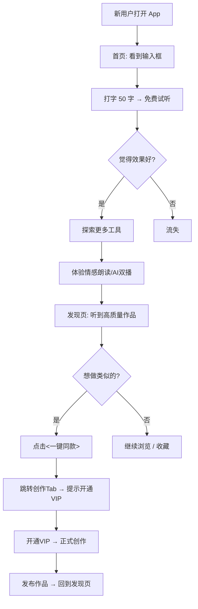

# 07 — 产品模块定位优化方案

> 版本: v1.1 | 日期: 2026-03-14（更新 AI 音乐/广播剧模块）

---

## 一、现状问题诊断

### 1.1 截图分析

| 页面 | 当前状态 | 问题 |
|:-----|:---------|:-----|
| 首页 | "文本转语音" + "AI 创作工作台" + 4 个 PRO 工具卡片 | ❌ 工具入口与创作入口混在一起，用户不知道先体验什么 |
| 发现 | 作品广场 + 分类筛选 | ⚠️ 空内容（暂无内容），新用户看到就走了 |
| 创作 | AI 创作工作台（项目管理） | ⚠️ 定位冲突 — 跟首页的"AI 创作工作台"入口重复 |
| 我的 | VIP + 配额 + 设置 | ✅ 基本 OK |

### 1.2 核心定位问题

```
当前：首页 = 工具目录表 + PRO 功能锁
问题：用户进来看到一堆按钮，不知道做什么，没有引导感
```

**用户心理分析**：
- 新用户："这个 App 能做什么？" → 看到 6 个按钮 → 选择困难 → 流失
- 老用户："我想继续上次的创作" → 要找创作入口 → 首页找不到（要点 Tab）
- 犹豫用户："值不值得开 VIP？" → 没有体验对比 → 不知道 VIP 有什么不同

---

## 二、优化方案：Freemium 漏斗模型

### 2.1 核心理念

```
首页 = 体验区（免费试玩 → 种草）
创作 = 生产区（VIP 创作 → 付费）
发现 = 内容区（UGC 生态 → 留存）
```

### 2.2 四页重新定位

| Tab | 新名称 | 定位 | 核心用户场景 |
|:----|:------|:-----|:-------------|
| 首页 | **AI 工坊** | 🎯 工具体验试玩场 | "3 秒输入文字，听到 AI 配音效果" |
| 发现 | **灵感** | 🌟 优质作品 + 创作模板 | "听到别人做的，我也想做" |
| 创作 | **工作台** | 🔨 正式创作 + 项目管理 | "开始做我的有声小说/播客" |
| 我的 | **我的** | 👤 资产管理 | "看配额、管理作品、VIP" |

---

## 三、首页改版方案 — AI 工坊

### 3.1 布局架构

```
┌──────────────────────────────────────┐
│  声读                          🔔    │
│  让文字发声，为内容赋能                  │
├──────────────────────────────────────┤
│                                      │
│  ┌────────────────────────────────┐  │
│  │  🎙️ 快速体验                    │  │
│  │  输入文字，1秒生成配音 ▶          │  │
│  │  ┌──────────────────────────┐  │  │
│  │  │ 在这里输入任意文字试试...   │  │  │
│  │  │                          │  │  │
│  │  └──────────────────────────┘  │  │
│  │  [🔊 立即试听]         0/50字  │  │
│  └────────────────────────────────┘  │
│                                      │
│  🛠️ AI 工具箱                        │
│  ┌──────────┐ ┌──────────┐          │
│  │ 🎙️       │ │ 🎭       │          │
│  │ 文字配音  │ │ 情感朗读  │          │
│  │ 输入即读  │ │ 有感情地读│          │
│  │ [免费体验] │ │ [免费体验]│          │
│  └──────────┘ └──────────┘          │
│  ┌──────────┐ ┌──────────┐          │
│  │ 🎧       │ │ 🗣️       │          │
│  │ AI 播客  │ │ 声音复刻  │          │
│  │ 双人对谈  │ │ 克隆你的声│          │
│  │ [试听Demo]│ │ [录制体验]│          │
│  └──────────┘ └──────────┘          │
│                                      │
│  💎 升级创作                          │
│  ┌────────────────────────────────┐  │
│  │  开通 VIP，解锁无限创作          │  │
│  │  情感配音 · 声音克隆 · AI编排    │  │
│  │  [查看方案 →]                    │  │
│  └────────────────────────────────┘  │
│                                      │
│  🔥 精选作品                          │
│  ┌──────┐ ┌──────┐ ┌──────┐         │
│  │ 作品1 │ │ 作品2 │ │ 作品3 │        │
│  └──────┘ └──────┘ └──────┘         │
└──────────────────────────────────────┘
```

### 3.2 关键设计要素

**① 快速体验区（最顶部）**
- 直接在首页放一个**可输入文本框** + 试听按钮
- 新用户 0 学习成本：打字 → 按钮 → 听到声音 → "哇！"
- 限制：免费 50 字/次，不可下载（引导注册/VIP）

**② AI 工具箱（4 宫格）**
- 每个工具都可以**免费体验**几次（体验次数后引导 VIP）

### 3.3 工具命名优化

| 当前名称 | 问题 | 新名称建议 | 理由 |
|:---------|:-----|:-----------|:-----|
| 文本转语音 | 太技术化 | **文字配音** | 用户语言，更像"服务" |
| 情感合成 v2 | 版本号无意义 | **情感朗读** | 强调"有感情"的差异点 |
| AI 播客 | OK但不够吸引 | **AI 双播** | 突出"两个人对话"的独特性 |
| 声音复刻 | OK | **声音分身** | 更有科技感和画面感 |
| 同声传译 | 功能待开发 | **AI 翻译配音** | 更明确场景 |
| AI 创作工作台 | 名称太长 | **AI 工作台** | 简洁，放在创作 Tab |

---

## 四、发现页改版 — 灵感广场

### 4.1 核心问题

发现页当前**没有内容**（暂无内容），这是致命的 — 新用户看到空内容直接流失。

### 4.2 解决方案

**冷启动策略**：
1. **官方精选作品** — 预埋 20-30 个高质量 Demo 作品
2. **创作模板** — "一键同款"，降低创作门槛
3. **排行榜** — 按播放量/点赞排序

**布局建议**：
```
┌──────────────────────────────────┐
│           灵 感                   │
│     发现好声音，激发创造力          │
├──────────────────────────────────┤
│  📢 编辑推荐  (横向轮播)           │
│  ┌─────────────────────────────┐ │
│  │ "重生之我在修仙界当程序员"    │ │
│  │  ▶ 3.2万播放  ♥ 1.8k        │ │
│  └─────────────────────────────┘ │
│                                  │
│  🏷️ 热门分类                     │
│  [有声小说] [情感散文] [播客对谈]  │
│  [新闻播报] [广告配音] [儿童故事]  │
│                                  │
│  🔥 热门作品                      │
│  ┌──────────────────────────┐    │
│  │ 作品卡片 + 试听按钮        │    │
│  │ [🎙️ 一键同款] ← 跳转创作  │    │
│  └──────────────────────────┘    │
└──────────────────────────────────┘
```

---

## 五、用户漏斗路径



---

## 六、各 Tab 与现有路由的映射

| 底部 Tab | 指向路由 | 对应组件 | 说明 |
|:---------|:--------|:---------|:-----|
| **AI 工坊** | `/` | Home.vue | 首页改版：快速体验 + 工具箱 |
| **灵感** | `/discover` | Discover.vue | 发现页改版：UGC + 模板 |
| **工作台** | `/studio` | Studio.vue | 已有，创作项目管理 |
| **AI 音乐** | `/music` | Music.vue | AI 写词 + 风格选择 + Mureka 生成 |
| **我的** | `/profile` | Profile.vue | 已有，基本 OK |

原有的 `/create`（基础 TTS 页面）改为从首页工具箱点击进入，不再占用 Tab 位。

---

## 七、免费 vs VIP 权益对比表

| 功能 | 免费用户 | VIP 会员 |
|:-----|:---------|:---------|
| 文字配音 | ✅ 50字/次，3次/天 | ✅ 无限字数 |
| 情感朗读 | ✅ 试听 Demo | ✅ 自定义文本 + 情感标签 |
| AI 双播 | ✅ 听官方 Demo | ✅ 自定义话题生成 |
| 声音分身 | ❌ | ✅ 克隆个人声纹 |
| AI 工作台 | ✅ 1个项目 | ✅ 无限项目 |
| **AI 广播剧** | ❌ | ✅ 多角色剧本生成 + 分角色 TTS 配音 + 情感标签 |
| **AI 音乐** | ❌ | ✅ AI 写词 + 自动生成歌名 + 风格选择 + 音乐生成 |
| 下载音频 | ❌ | ✅ 高品质 MP3 |
| 情感音色库 | ❌ TTS 1.0 音色 | ✅ TTS 2.0 全部音色 |
| 作品发布 | ❌ | ✅ 发布到灵感广场 |

---

## 八、个人选型理解

> **Q: 你的产品模块是怎么设计的？**

我们采用 **Freemium 漏斗模型**，把产品分为三层：

1. **体验层（首页 AI 工坊）** — 零门槛试玩，3 秒内让用户听到 AI 配音效果，用体验驱动转化
2. **内容层（发现/灵感）** — UGC 作品 + "一键同款"模板，用内容激发创作欲望
3. **生产层（工作台）** — VIP 正式创作空间，多项目管理、高级音色、发布能力

核心逻辑是 **"先尝后买"** — 免费用户可以体验所有 AI 能力（有次数/字数限制），当他想正式创作和发布时才需要 VIP。

---

## 九、创作工作台 UX 优化（2026-02-27 实施）

### 9.1 问题诊断

| 问题 | 影响 | 优先级 |
|:-----|:-----|:------:|
| 5 种创作方向隐藏在「新建创作」按钮后面 | 用户看不到平台核心能力 | P0 |
| 项目列表使用统一灰色图标，视觉像文件管理器 | 缺乏吸引力和品牌感 | P1 |
| 空态只有一行灰色文字 | 无感召力，不引导行动 | P1 |
| 灵感输入仅靠 3 个硬编码示例 | 灵感不足，创作门槛高 | P0 |
| 新建弹窗视觉平庸 | 核心转化节点缺乏仪式感 | P1 |

### 9.2 已完成优化

**① 快速开始卡片（P0）**
- 在项目列表上方新增横向滚动的 5 种创作方向卡片
- 每种类型配专属渐变色背景（如有声小说=蓝靛、广播剧=紫粉）
- 点击直接打开新建弹窗，减少一步操作

**② 项目列表美化（P1）**
- 每种项目类型匹配专属渐变色图标（蓝/紫/绿/橙/红）
- 增加灵感摘要预览，丰富卡片信息密度
- 状态使用彩色圆点（创作中=橙色脉冲、已完成=绿色）
- 列表底部添加蓝色创作小贴士卡片

**③ 空态引导升级（P1）**
- 大面积星光渐变引导卡片（紫蓝渐变）
- 文案："你的主场，从这里开始 🎙️"
- 带呼吸灯动效的 CTA 按钮

**④ 新建创作弹窗重构（P1）**
- 顶部主题色渐变装饰条
- 渐变色图标头部 + 圆形关闭按钮
- 🎲 AI 灵感骰子替代硬编码示例（见下方）
- 快捷灵感标签（本地 + AI 推荐双模式）
- 全宽主题色 CTA 按钮（悬浮放大、按压缩小动效）
- AI 构思中的情感化 Loading（脉冲球 + 轮播文案 + 进度点）
- 空输入 shake 抖动防呆

**⑤ LLM 驱动智能灵感（P0）**
- 🎲 按钮升级为「🌟 AI 换灵感」，调用 `GET /studio/templates/{typeCode}/inspiration`
- 后端 `StudioService.generateInspiration()` → LangChain4j + 豆包大模型
- Prompt 角色：创意灵感生成器，按类型生成 6 个 15-30 字灵感种子
- 前端渲染为 ✨ 橙色标签，标注「AI 推荐」，点击即填入
- 失败时自动 fallback 到本地硬编码示例 + Toast 提示

### 9.3 个人选型理解

> **Q: 创作模块你做了哪些 UX 优化？**

从三个维度优化：

1. **降低发现成本** — 把 5 种创作方向从按钮弹窗里提到页面顶部做成快速开始卡片，用户一进来就能看到平台完整能力
2. **降低创作门槛** — 接入 LLM 大模型做灵感推荐，用户点击「AI 换灵感」按钮，AI 根据创作类型实时生成 6 个有画面感和冲突感的灵感种子，点击即可开始
3. **提升仪式感** — 把创建流程从"填表提交"变成沉浸式体验：主题色弹窗 → AI 构思动画 → 进入编辑器，让用户感受到"AI 真的在为我工作"

