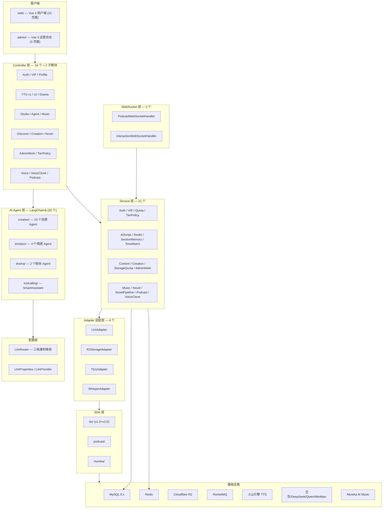
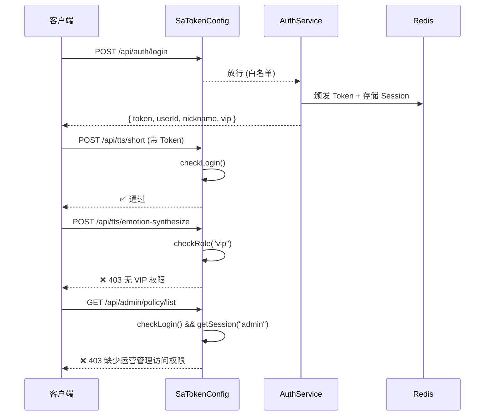
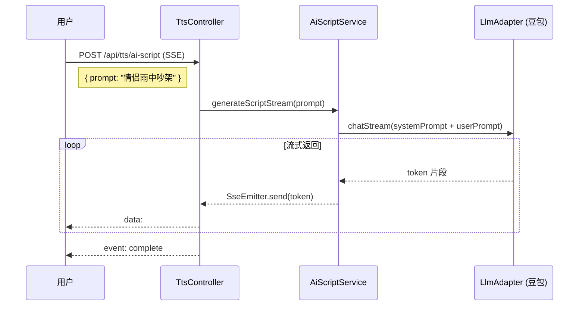
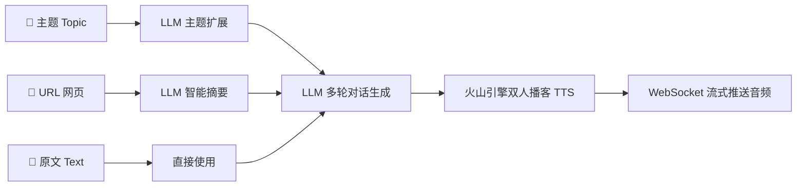
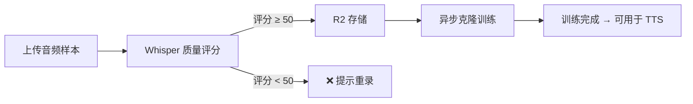
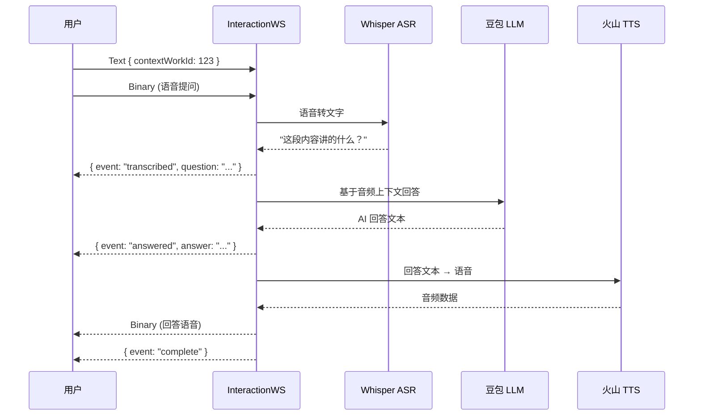
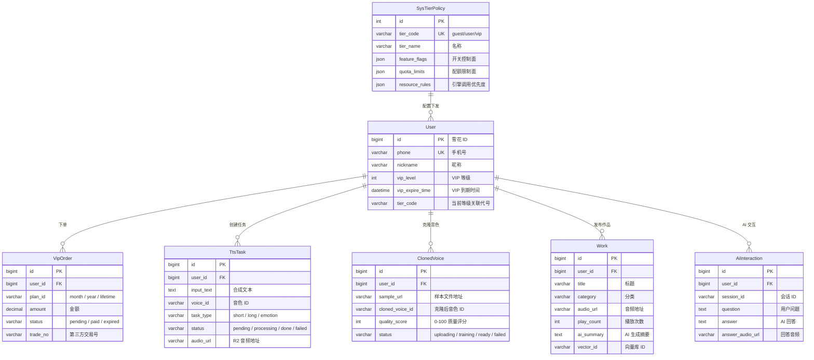

# 🎙️ 声读 SoundRead — 后端服务

> **AI 语音合成与内容创作平台 · Java 后端**

声读是一个面向内容创作者的一站式 AI 语音平台，提供 TTS 合成 (v1.0 + v2.0 情感)、AI 创作工坊 (8 种类型)、AI 播客、AI 音乐生成、声音克隆、有声书 Pipeline、Tool Calling 智能助手等核心能力。本仓库为 **Spring Boot 3 后端服务**，包含 16 个 Controller、21 个 Service、20 个 AI Agent、21 张数据库表。

---

## 📋 目录

- [技术架构](#-技术架构)
- [技术栈](#-技术栈)
- [项目结构](#-项目结构)
- [核心模块详解](#-核心模块详解)
- [AI 能力矩阵](#-ai-能力矩阵)
- [API 接口文档](#-api-接口文档)
- [WebSocket 协议](#-websocket-协议)
- [数据库设计](#-数据库设计)
- [错误码规范](#-错误码规范)
- [编码规范](#-编码规范)
- [配置说明](#-配置说明)
- [快速启动](#-快速启动)
- [待完善项](#-待完善项)

---

## 🏗️ 技术架构

### 整体分层



### 设计原则

| 原则 | 说明 |
|------|------|
| **分层解耦** | Controller → Service → Adapter → Infrastructure，各层职责单一，依赖只向下传递 |
| **适配器模式** | 所有外部依赖 (TTS SDK / LLM / R2 存储) 通过 Adapter 隔离，可随时替换底层实现 |
| **异步优先** | 长文本合成、声音克隆等耗时操作走 `@Async` + RocketMQ 异步任务队列 |
| **实时通信** | TTS 流式合成、播客生成、边听边问均通过 WebSocket 实现双向流式传输 |
| **配额限流** | Redis INCR 实现每日滑动窗口计数，免费/VIP 差异化限额 |

---

## 🛠️ 技术栈

| 类别 | 技术 | 版本 | 选型理由 |
|------|------|------|----------|
| **核心框架** | Spring Boot | 3.2.5 | Java 17 + 虚拟线程就绪，生态成熟 |
| **认证鉴权** | Sa-Token + JWT | 1.38.0 | 轻量级无状态认证，支持路由级权限拦截、角色校验、踢人下线 |
| **ORM** | MyBatis-Plus | 3.5.6 | 内置雪花 ID、逻辑删除、分页，零 XML 开发 |
| **数据库** | MySQL | 8.x | 成熟稳定，InnoDB 行级锁满足并发需求 |
| **缓存** | Redis | 7.x | Session 共享、配额计数 (INCR + TTL)、点赞去重 (Set) |
| **对象存储** | Cloudflare R2 | S3 兼容 | 零出口流量费，S3 API 兼容可无缝切换至 AWS/阿里云 OSS |
| **消息队列** | RocketMQ | 2.3.0 | 异步任务解耦 (长文合成/声音克隆训练) |
| **AI Agent** | LangChain4j | 0.30.0 | 声明式 Agent + Tool Calling + 模板方法模式 |
| **LLM** | 豆包/DeepSeek/Qwen/MiniMax | 多供应商 | 三级瀑布降级路由，兼容 OpenAI 格式 |
| **TTS** | 火山引擎 | v1.0 + v2.0 | v1 同步/异步短文、v2 WebSocket 流式情感合成 |
| **ASR** | Whisper | v1 | 语音识别、字幕生成、音频质量检测 |
| **AI 音乐** | Mureka API | — | AI 作曲/纯音乐/歌词生成 |
| **向量库** | pgvector | — | LangChain4j pgvector 语义存储 |
| **HTTP 客户端** | OkHttp | 4.12 | 连接池复用，拦截器链式处理 |
| **JSON** | Fastjson2 | 2.0.47 | 高性能序列化 |

---

## 📁 项目结构

```
server/
├── pom.xml                                    # Maven 依赖管理 (artifactId: soundread-server)
├── sdk/                                       # 火山引擎 SDK (本地依赖)
│   ├── tts/                                   #   TTS v1.0 + v2.0
│   ├── podcast/                               #   播客 TTS
│   ├── mureka/                                #   Mureka AI Music
│   └── common/                                #   通用协议
└── src/main/
    ├── java/com/soundread/
    │   ├── SoundReadApplication.java          # 启动类 (@EnableAsync @EnableScheduling)
    │   │
    │   ├── config/                            # ── 配置层 (7 + ai/5) ──
    │   │   ├── SaTokenConfig.java             #   路由级权限拦截 + CORS
    │   │   ├── R2Config.java                  #   S3Client / S3Presigner Bean
    │   │   ├── WebSocketConfig.java           #   注册 /ws/podcast, /ws/interaction
    │   │   ├── JacksonConfig.java             #   Long→String 序列化 + JavaTimeModule
    │   │   ├── MybatisPlusConfig.java         #   分页插件 + 自动填充
    │   │   ├── VolcengineConfig.java          #   火山引擎认证配置
    │   │   ├── AutoFillHandler.java           #   MyBatis-Plus 自动填充处理器
    │   │   └── ai/                            #   AI 模型路由层
    │   │       ├── LlmRouter.java             #     三级瀑布降级路由器
    │   │       ├── LlmProperties.java         #     多供应商配置属性
    │   │       ├── LlmProvider.java           #     供应商枚举
    │   │       ├── FallbackChatModel.java     #     降级 ChatModel
    │   │       └── FallbackStreamingChatModel.java  # 降级 StreamingChatModel
    │   │
    │   ├── common/                            # ── 通用模块 ──
    │   │   ├── Result.java                    #   统一响应体 { code, message, data }
    │   │   ├── ResultCode.java                #   错误码枚举
    │   │   ├── RequireFeature.java            #   功能开关注解
    │   │   ├── FeatureCheckAspect.java        #   AOP 切面: 自动校验功能权限
    │   │   └── exception/                     #   异常体系
    │   │       ├── BusinessException.java     #     业务异常 (400)
    │   │       ├── QuotaExceededException.java#     配额超限 (429)
    │   │       └── GlobalExceptionHandler.java#     @RestControllerAdvice 全局处理
    │   │
    │   ├── agent/                             # ── AI Agent 层 (LangChain4j, 20 个) ──
    │   │   ├── creative/                      #   创意创作 Agent (模板方法模式)
    │   │   │   ├── AbstractCreativeAgent.java  #     基类 (统一生成+TTS+记忆链)
    │   │   │   ├── CreativeAgentFactory.java   #     工厂: typeCode → Agent
    │   │   │   ├── DramaAgent.java             #     AI 短剧
    │   │   │   ├── RadioAgent.java             #     情感电台
    │   │   │   ├── PodcastAgent.java           #     AI 播客
    │   │   │   ├── NovelAgent.java             #     AI 小说
    │   │   │   ├── LectureAgent.java           #     知识讲解
    │   │   │   ├── AdCopyAgent.java            #     带货文案
    │   │   │   ├── PictureBookAgent.java       #     有声绘本
    │   │   │   ├── NewsAgent.java              #     新闻播报
    │   │   │   └── MusicLyricAgent.java        #     AI 歌词
    │   │   ├── emotion/                        #   情感分析 Agent
    │   │   │   ├── QuickDubbingAgent.java       #     快速配音
    │   │   │   ├── DirectorScriptAgent.java     #     剧情导演
    │   │   │   ├── MoodAnalyzerAgent.java       #     语气推荐
    │   │   │   └── EmotionAnnotatorAgent.java   #     情感标注
    │   │   ├── drama/                          #   剧本 Agent
    │   │   │   ├── ChapterSplitterAgent.java   #     智能分章
    │   │   │   └── ScriptWriterAgent.java      #     SSE 流式剧本
    │   │   └── toolcalling/                    #   Tool Calling
    │   │       ├── SmartAssistant.java         #     智能助手 Agent
    │   │       └── SoundReadTools.java         #     8 个工具函数
    │   │
    │   ├── model/                             # ── 数据模型 ──
    │   │   ├── EmotionState.java              #   情感状态枚举
    │   │   ├── entity/  (13 个)                #   数据库实体
    │   │   └── dto/     (7 个)                 #   请求/响应 DTO
    │   │
    │   ├── entity/                            # ── 扩展实体 (8 个) ──
    │   │   ├── NovelProject/Chapter/Segment   #   有声书三件套
    │   │   ├── UserCreation / UserStorage      #   创作记录 + 存储计量
    │   │   ├── SysVoice / UserVoice           #   音色库 + 用户音色
    │   │   └── VoiceOrder                     #   音色购买订单
    │   │
    │   ├── mapper/  (21 个)                   # ── MyBatis-Plus Mapper ──
    │   ├── adapter/ (4 个)                    # ── 外部适配层 ──
    │   │   ├── LlmAdapter.java               #   豆包 LLM (对话/审核/翻译/摘要)
    │   │   ├── R2StorageAdapter.java          #   Cloudflare R2 (上传/签名/删除)
    │   │   ├── Tts1Adapter.java               #   火山 TTS v1.0 (同步+异步)
    │   │   └── WhisperAdapter.java            #   Whisper ASR (转写/质检)
    │   │
    │   ├── service/ (21 + 2 impl)            # ── 业务逻辑层 ──
    │   │   ├── StudioService.java (38KB)      #   AI 创作工坊核心
    │   │   ├── MusicService.java (17KB)       #   AI 音乐 (Mureka)
    │   │   ├── NovelPipelineService.java      #   有声书4阶段Pipeline
    │   │   ├── SectionMemoryService.java      #   双引擎混合记忆
    │   │   ├── CreationService.java           #   创作历史统一管理
    │   │   └── ...更多 Service               #   Auth/Quota/TierPolicy/...
    │   │
    │   ├── controller/ (16 + 2 子模块)       # ── 接口控制层 ──
    │   │   ├── TtsController.java             #   /api/tts/* (含 SSE)
    │   │   ├── TtsV2Controller.java           #   /api/tts/v2/* (情感合成)
    │   │   ├── StudioController.java (14KB)   #   /api/studio/*
    │   │   ├── AgentController.java           #   /api/agent/* (Tool Calling)
    │   │   ├── MusicController.java           #   /api/music/*
    │   │   ├── ttsdrama/                      #   多角色短剧子模块
    │   │   ├── ttsv2/                         #   情感合成子模块
    │   │   └── ...更多 Controller             #   Auth/Discover/Creation/Novel/...
    │   │
    │   ├── job/                               # ── 定时任务 ──
    │   │   ├── HeatScoreJob.java              #   作品热度分计算
    │   │   └── DataRetentionJob.java          #   数据生命周期清理
    │   │
    │   └── websocket/                         # ── WebSocket (2 个) ──
    │       ├── PodcastWebSocketHandler.java   #   /ws/podcast
    │       └── InteractionWebSocketHandler.java #  /ws/interaction
    │
    └── resources/
        ├── application.yml                    # 全量配置 (环境变量注入)
        ├── application-example.yml            # 配置模板
        └── logback-spring.xml                 # 日志配置
```

> **统计：** 120+ Java 源文件 · 21 Mapper · 21 Service · 16 Controller · 20 Agent · 4 Adapter · 2 WebSocket · 2 Job

---

## 🧩 核心模块详解

### 1. 认证与鉴权 (Auth)

基于 **Sa-Token + JWT** 实现无状态认证，路由级权限控制。



**权限与配额控制 (Tier Policy) 结合双轨 RBAC：**

利用 `sys_tier_policy` 表实现会员体系的三大控制面管理：
1. **`feature_flags` (功能开关)**: 是否开放音色克隆、情感合成、多语言。
2. **`quota_limits` (配额限制)**: 每日限额，超限阻断 (`QuotaExceededException`)。
3. **`resource_rules` (资源规则)**: GPU 排队优先级及 LLM 大模型切换。

> 权限及配额通过自定义注解 `@RequireFeature("ai_podcast")` 和 AOP 切面实现无侵入拦截。
> 运营后台则通过 `User` 表级的 `role=admin` 强阻断，保证管理台路由只能被内部人员访问。修改策略字典后自动触发 Redis 缓存双活清理，全网 0 发版热更新。

| 功能 | 免费用户 | VIP 用户 |
|------|:-------:|:-------:|
| 短文本合成 | ✅ 2000字/天 | ✅ 无限 |
| 情感合成 v2.0 | ❌ | ✅ |
| AI 剧本生成 | ✅ | ✅ |
| AI 播客生成 | ❌ | ✅ |
| 声音克隆 | ✅ 1次体验 | ✅ |
| 发现页浏览 | ✅ | ✅ |
| 边听边问 | ✅ 5次/天 | ✅ 无限 |

### 2. TTS 语音合成

提供三种合成模式，覆盖从简单朗读到专业配音的全场景：

| 模式 | SDK 版本 | 协议 | 特点 |
|------|---------|------|------|
| 短文本合成 | TTS v1.0 | REST 同步 | ≤300字，直接返回音频 URL |
| 情感合成 | TTS v2.0 | WebSocket 流式 | 支持情感指令 (`#开心` `#悲伤` `#四川话`) |
| 长文本合成 | TTS v1.0 Async | REST + 轮询 | 万字级别，提交后异步回调 |

**AI 剧本生成流程：**



### 3. AI 播客

支持三种来源自动生成双人播客对话：



### 4. 声音克隆



**质量评分算法** (WhisperAdapter)：
- 基础分 50 + 转写内容 >20字 (+20) + >50字 (+15) + 无断句 (+10) + 无噪音 (+5)
- 满分 100，低于 50 分提示用户重新录制

### 5. 边听边问 AI 交互

完整的**语音闭环交互**，用户无需打字：



### 6. 配额限流

基于 **Redis INCR + TTL** 实现每日自动重置的滑动窗口计数：

```
Key 格式:    quota:{userId}:{date}:{feature}
示例:        quota:10001:2026-02-23:text → 已用字数
             quota:10001:2026-02-23:ask  → 已用次数
过期策略:    每个 Key 设置 25h TTL，跨时区容错后自动清零
```

---

## 🤖 AI 能力矩阵

### LangChain4j Agent 架构

| # | Agent | 实现类 | 模式 | 用途 |
|---|-------|--------|------|------|
| 1 | AI 短剧 | `creative/DramaAgent` | 模板方法 | 多角色对话 + 情感标注 |
| 2 | 情感电台 | `creative/RadioAgent` | 模板方法 | 深夜治愈独白 |
| 3 | AI 播客 | `creative/PodcastAgent` | 模板方法 | 双人对话式播客 |
| 4 | AI 小说 | `creative/NovelAgent` | 模板方法 | 网络小说章节 |
| 5 | 知识讲解 | `creative/LectureAgent` | 模板方法 | 费曼式科普 |
| 6 | 带货文案 | `creative/AdCopyAgent` | 模板方法 | 产品推荐文案 |
| 7 | 有声绘本 | `creative/PictureBookAgent` | 模板方法 | 儿童故事 |
| 8 | 新闻播报 | `creative/NewsAgent` | 模板方法 | 专业新闻稿 |
| 9 | AI 歌词 | `creative/MusicLyricAgent` | 模板方法 | 歌词创作 |
| 10 | 快速配音 | `emotion/QuickDubbingAgent` | 声明式 | 凭空独立创作台词 |
| 11 | 剧情导演 | `emotion/DirectorScriptAgent` | 声明式 | 承接前情续写 |
| 12 | 语气推荐 | `emotion/MoodAnalyzerAgent` | 声明式 | 分析上文推荐语气 |
| 13 | 情感标注 | `emotion/EmotionAnnotatorAgent` | 声明式 | 逐段 cot 标注 |
| 14 | 智能分章 | `drama/ChapterSplitterAgent` | 声明式 | 有声小说分章 |
| 15 | 流式剧本 | `drama/ScriptWriterAgent` | 声明式 | SSE 流式 AI 剧本 |
| 16 | 智能助手 | `toolcalling/SmartAssistant` | Tool Calling | 8 个工具函数对话 |

### 底层 AI 能力

| # | AI 能力 | 实现类 | 底层技术 | 触发场景 |
|---|---------|--------|----------|----------|
| 1 | AI 剧本生成 | `AiScriptService` | LLM 流式 SSE | 用户输入场景 Prompt |
| 2 | 智能分角引擎 | `ScriptParser` | LLM JSON Mode | 剧本生成后自动推荐音色 |
| 3 | 情感自动标注 | `AiScriptService` | LLM 情感分析 | 用户粘贴原文后一键标注 |
| 4 | 播客多轮对话 | `PodcastService` | LLM Agent | 主题/URL/原文 → 播客脚本 |
| 5 | AI 音乐生成 | `MusicService` | Mureka API | 歌曲/纯音乐/歌词创作 |
| 6 | 摘要压缩记忆 | `SectionMemoryService` | LLM 摘要 | 续写时注入上下文 |
| 7 | 智能语气匹配 | `ToneMatchService` | LLM 分析 | AI 推荐匹配语气 |
| 8 | 内容安全审核 | `LlmAdapter` | LLM 分类 | 作品发布前自动审核 |
| 9 | AI 翻译 | `LlmAdapter` | LLM 翻译 | 跨语言语音合成 |
| 10 | 音频质量检测 | `WhisperAdapter` | Whisper ASR | 声音克隆样本上传时 |
| 11 | AI 字幕生成 | `WhisperAdapter` | Whisper SRT | 合成音频的字幕导出 |
| 12 | 边听边问 | `AiInteractionService` | Whisper+LLM+TTS | 收听时语音提问 |

---

## 📡 API 接口文档

### 认证模块 `/api/auth`

| 方法 | 路径 | 说明 | 认证 |
|------|------|------|:----:|
| POST | `/api/auth/login` | 密码登录 | ❌ |
| POST | `/api/auth/sms-code?phone={phone}` | 发送验证码 | ❌ |
| POST | `/api/auth/sms-login` | 验证码登录 (自动注册) | ❌ |
| POST | `/api/auth/register` | 手机号注册 | ❌ |
| GET | `/api/auth/me` | 获取当前用户信息 | ✅ |
| POST | `/api/auth/logout` | 退出登录 | ✅ |

<details>
<summary><b>请求/响应示例 — 密码登录</b></summary>

```json
// POST /api/auth/login
{
    "phone": "13800138000",
    "password": "******"
}

// 200 OK
{
    "code": 200,
    "message": "success",
    "data": {
        "token": "Bearer xxxx-xxxx-xxxx",
        "userId": 10001,
        "nickname": "声读用户",
        "vip": false
    }
}
```
</details>

---

### TTS 合成模块 `/api/tts`

| 方法 | 路径 | 说明 | 认证 | 权限 |
|------|------|------|:----:|------|
| POST | `/api/tts/short` | 短文本合成 | ✅ | 免费 (限额) |
| POST | `/api/tts/ai-script` | AI 剧本生成 (SSE) | ✅ | VIP |
| POST | `/api/tts/emotion-synthesize` | 情感合成 | ✅ | VIP |
| POST | `/api/tts/long-text` | 长文本异步任务 | ✅ | 免费 (限额) |
| GET | `/api/tts/long-text/{taskId}` | 查询异步任务进度 | ✅ | — |
| GET | `/api/tts/voices` | 获取可用音色列表 | ❌ | — |

<details>
<summary><b>请求示例 — 短文本合成</b></summary>

```json
// POST /api/tts/short
// Authorization: Bearer <token>
{
    "text": "你好，欢迎使用声读",
    "voiceId": "BV001_streaming",
    "speed": 1.0,
    "volume": 1.0,
    "pitch": 1.0
}
```
</details>

<details>
<summary><b>请求示例 — AI 剧本 (SSE 流式)</b></summary>

```http
POST /api/tts/ai-script
Authorization: Bearer <token>
Content-Type: application/json
Accept: text/event-stream

{ "prompt": "一段夫妻吵架后和好的对话，女方委屈，男方愧疚" }

// SSE 流式响应
data: #无奈
data: 【叹气】我真的不知道
data: 还能怎么做...
```
</details>

---

### 播客模块 `/api/podcast`

| 方法 | 路径 | 说明 | 认证 | 权限 |
|------|------|------|:----:|------|
| POST | `/api/podcast/generate` | 生成播客 | ✅ | VIP |
| GET | `/api/podcast/presets` | 主播预设组合 | ✅ | — |

---

### 声音克隆模块 `/api/voice`

| 方法 | 路径 | 说明 | 认证 | 权限 |
|------|------|------|:----:|------|
| POST | `/api/voice/upload-sample` | 上传声音样本 | ✅ | VIP |
| POST | `/api/voice/clone?sampleId={id}` | 发起克隆 | ✅ | VIP |
| GET | `/api/voice/clone/{id}/status` | 查询克隆状态 | ✅ | — |

---

### 发现模块 `/api/discover`

| 方法 | 路径 | 说明 | 认证 |
|------|------|------|:----:|
| GET | `/api/discover/banners` | 轮播图 (热门 Top5) | ❌ |
| GET | `/api/discover/works?category=hot&page=1&size=20` | 作品列表 (分页) | ❌ |
| POST | `/api/discover/works/{id}/play` | 增加播放计数 | ❌ |
| POST | `/api/discover/works/{id}/like` | 点赞/取消 (幂等) | ✅ |

---

### VIP 模块 `/api/vip`

| 方法 | 路径 | 说明 | 认证 |
|------|------|------|:----:|
| GET | `/api/vip/plans` | 套餐列表 | ❌ |
| POST | `/api/vip/orders` | 创建支付订单 | ✅ |
| POST | `/api/vip/callback/wechat` | 微信支付回调 | ❌ |
| GET | `/api/vip/status` | 查询会员状态 | ✅ |

---

### 运营后台模块 `/api/admin/policy`

| 方法 | 路径 | 说明 | 认证 | 权限 |
|------|------|------|:----:|------|
| GET | `/api/admin/policy/list` | 策略列表 (可视化配置) | ✅ | Admin |
| PUT | `/api/admin/policy/{id}` | 修改阶层配额并刷新缓存 | ✅ | Admin |
| POST | `/api/admin/policy/refresh`| 手动执行全量热更新 | ✅ | Admin |

---

## 🔌 WebSocket 协议

### 1. 播客流式 `/ws/podcast`

| 方向 | 类型 | 内容 |
|------|------|------|
| → Client | Text | `{ "action":"generate", "text":"...", "voiceA":"...", "voiceB":"...", "headMusic":true }` |
| ← Server | Text | `{ "event":"round_start", "roundId":1, "speaker":"A" }` |
| ← Server | Binary | 主播 A 音频 |
| ← Server | Text | `{ "event":"round_end", "roundId":1 }` |
| ← Server | Text | `{ "event":"complete", "duration":120 }` |

### 3. 边听边问 `/ws/interaction`

| 方向 | 类型 | 内容 |
|------|------|------|
| → Client | Text | `{ "contextWorkId":123, "sessionId":"uuid" }` (绑定上下文) |
| → Client | Binary | 用户语音数据 |
| ← Server | Text | `{ "event":"transcribed", "question":"转写结果" }` |
| ← Server | Text | `{ "event":"answered", "answer":"AI 回答" }` |
| ← Server | Binary | TTS 合成的回答语音 |
| ← Server | Text | `{ "event":"complete" }` |

---

## 🗄️ 数据库设计

共 **21 张表**，统一使用 MyBatis-Plus **雪花 ID** 主键 + **逻辑删除** (`deleted` 字段)。

| 分组 | 表名 | 说明 |
|------|------|------|
| 核心 | `user` | 用户 (含 VIP/tier_code/role) |
| 核心 | `vip_order` | VIP 订单 |
| 核心 | `sys_tier_policy` | 会员策略字典 (JSON 三面) |
| TTS | `tts_task` | TTS 异步任务 |
| 音色 | `sys_voice` | 系统音色库 (v1.0 + v2.0) |
| 音色 | `cloned_voice` | 克隆音色 |
| 音色 | `user_voice` | 用户已购音色 |
| 音色 | `voice_order` | 音色购买订单 |
| 内容 | `work` | 作品表 (含审核/热度/内容类型) |
| 内容 | `user_creation` | 创作记录 (统一所有模块) |
| 内容 | `user_storage` | 存储计量 |
| AI | `ai_interaction` | AI 交互记录 |
| AI | `ai_prompt_category` | AI 指令库分类 |
| AI | `ai_prompt_role` | AI 指令库角色 |
| 创作 | `creative_template` | 创作模板 (8 种类型) |
| 创作 | `studio_project` | 创作工坊项目 |
| 创作 | `studio_section` | 创作工坊分段 (含 summary) |
| 小说 | `novel_project` | 有声书项目 |
| 小说 | `novel_chapter` | 有声书章节 |
| 小说 | `novel_segment` | 有声书分段 (含情感标注) |
| 音乐 | `music_task` | AI 音乐任务 (含 HLS) |

### E-R 关系图



> 完整建表语句见 `docs/sql/` 目录

---

## ❌ 错误码规范

### HTTP 状态码

| 状态码 | 含义 | 触发场景 |
|-------|------|----------|
| `200` | 成功 | 正常响应 |
| `400` | 请求参数错误 | 参数校验失败、业务逻辑异常 (BusinessException) |
| `401` | 未认证 | Token 缺失/过期/无效 (Sa-Token NotLoginException) |
| `403` | 无权限 | 角色校验失败 (Sa-Token NotRoleException) |
| `429` | 配额超限 | 超出免费/VIP 每日限额 (QuotaExceededException) |
| `500` | 服务器错误 | 未预期异常 |

### 业务错误码

| code | message | 说明 |
|------|---------|------|
| `200` | success | 成功 |
| `400` | 手机号已注册 | 重复注册 |
| `400` | 验证码错误或已过期 | SMS 验证失败 |
| `400` | 文本内容为空 | TTS 参数校验 |
| `400` | 文本超出长度限制 | 超出 300 字 (短文本) |
| `401` | 未登录 | Token 缺失 |
| `403` | 该功能需要 VIP 权限 | 非 VIP 调用 VIP 接口 |
| `429` | 今日合成额度已用完 | 配额超限 |
| `429` | 今日互动次数已用完 | 边听边问超限 |

### 统一响应格式

```json
{
    "code": 200,
    "message": "success",
    "data": { ... }
}
```

---

## 📐 编码规范

### Java 后端规范

| 维度 | 规范 | 示例 |
|------|------|------|
| **命名** | 驼峰命名，类名 PascalCase | `UserService`, `getUserById` |
| **常量** | 全大写 + 下划线 | `MAX_TEXT_LENGTH = 300` |
| **包结构** | 按职责分包 | `controller/`, `service/`, `adapter/` |
| **Controller** | 只做参数校验 + 响应封装，不含业务逻辑 | 调用 Service 方法后 `return Result.ok(data)` |
| **Service** | 单一职责原则，事务操作加 `@Transactional` | 一个公开方法对应一个业务用例 |
| **Adapter** | 封装外部 SDK 调用，屏蔽第三方差异 | `LlmAdapter` 对外暴露 `chat()` 不暴露 OkHttp 细节 |
| **异常** | 使用自定义业务异常，禁止 `e.printStackTrace()` | `throw new BusinessException("手机号已注册")` |
| **日志** | 使用 SLF4J `@Slf4j`，禁止 `System.out` | `log.info("用户登录: userId={}", userId)` |
| **注释** | 公开方法必须 Javadoc，TODO 标记待办 | `/** 生成 AI 剧本 (SSE 流式) */` |
| **敏感信息** | 禁止硬编码密钥，统一使用 `${ENV_VAR:default}` | `${DOUBAO_API_KEY:}` |

### 分层依赖规则

```
Controller → Service → Adapter → 外部 SDK / API
     ↓           ↓
   Mapper      Redis
```

- ❌ Controller 不可直接调用 Adapter
- ❌ Service 不可直接依赖 Request/Response
- ❌ Adapter 不可直接调用 Mapper

### Git Commit 规范

```
<type>: <subject>

feat:      新功能
fix:       Bug 修复
refactor:  代码重构
docs:      文档更新
perf:      性能优化
test:      测试相关
chore:     构建/工具
```

---

## ⚙️ 配置说明

所有敏感配置通过 **环境变量** 注入，格式 `${ENV_VAR:default_value}`，生产环境禁止使用默认值。

### 必要环境变量

| 环境变量 | 说明 | 必填 |
|---------|------|:----:|
| `DB_PASSWORD` | MySQL 密码 | ✅ |
| `REDIS_PASSWORD` | Redis 密码 | ✅ |
| `JWT_SECRET` | JWT 签名密钥 | ✅ |
| `DOUBAO_API_KEY` | 豆包大模型 API Key | ✅ |
| `VOLCENGINE_APP_ID` | 火山引擎 TTS 应用 ID | ✅ |
| `VOLCENGINE_ACCESS_TOKEN` | 火山引擎 TTS Access Token | ✅ |
| `VOLCENGINE_API_KEY` | 火山引擎 IAM API Key | ✅ |
| `VOLCENGINE_SECRET_KEY` | 火山引擎 IAM Secret Key | ✅ |
| `R2_ACCESS_KEY_ID` | Cloudflare R2 Access Key | ✅ |
| `R2_SECRET_ACCESS_KEY` | Cloudflare R2 Secret Key | ✅ |

### 可选环境变量

| 环境变量 | 说明 | 默认值 |
|---------|------|--------|
| `R2_BUCKET_NAME` | R2 存储桶名称 | `aiyou` |
| `R2_ENDPOINT` | R2 S3 兼容端点 | (见 application.yml) |
| `R2_PUBLIC_DOMAIN` | R2 公开访问域名 | (见 application.yml) |
| `DOUBAO_MODEL_ID` | 豆包模型 ID | `doubao-seed-2-0-lite-260215` |
| `WHISPER_API_KEY` | Whisper ASR Key | — |
| `ROCKETMQ_NAME_SERVER` | RocketMQ 地址 | `localhost:9876` |

### 配额配置 (application.yml)

```yaml
quota:
  free:
    daily-text-chars: 100        # 免费用户每日合成字数
    daily-ask-count: 3           # 免费用户每日互动次数
  vip:
    daily-text-chars: -1         # VIP 无限 (-1)
    daily-ask-count: -1          # VIP 无限 (-1)
```

---

## 🚀 快速启动

### 环境要求

| 依赖 | 版本 |
|------|------|
| JDK | 17+ |
| Maven | 3.8+ |
| MySQL | 8.x |
| Redis | 6+ |

### 启动步骤

```bash
# 1. 克隆项目
git clone <repo-url>
cd soundread/server

# 2. 初始化数据库
mysql -u root -p < docs/sql/init/V1__core_schema.sql

# 3. 配置环境变量 (复制模板后填入真实值)
export DB_PASSWORD=your_password
export REDIS_PASSWORD=your_password
export DOUBAO_API_KEY=your_key
export VOLCENGINE_APP_ID=your_app_id
export VOLCENGINE_ACCESS_TOKEN=your_token
export R2_ACCESS_KEY_ID=your_key
export R2_SECRET_ACCESS_KEY=your_secret

# 4. 编译并启动
mvn clean package -DskipTests
java -jar target/soundread-server-1.0.0-SNAPSHOT.jar

# 或开发模式直接运行
mvn spring-boot:run
```

启动成功后访问 `http://localhost:8080`，健康检查 `GET /api/auth/me` 应返回 401。

---

## 📝 待完善项

| 模块 | 待办事项 | 优先级 |
|------|----------|:------:|
| 支付 | 接入微信/支付宝支付回调验签 | 🟡 中 |
| 短信 | 接入阿里云/腾讯云短信服务 | 🟡 中 |
| 推荐 | 基于 pgvector 实现语义推荐 | 🟢 低 |
| 监控 | 接入 Prometheus + Grafana 可观测性 | 🟢 低 |
| 测试 | 补充核心 Service 单元测试 | 🟢 低 |

---

## 📄 License

Private — SoundRead Team
